# GEOG 712 Reproducible Research

## Session 7. Creating packages in R and documenting datasets

In the preceding sessions we learned about Data Management Plans. There are several key aspects of these plans, including how to document not only data, but also how data were processed, and also how to transfer it, either to a supervisor, colleagues, students, or other interested parties.

In this session we will learn about packages in R. Although by no means the only way to document and share data (and processes), packages offer a convenient way of bundling up code, data, documentation, and examples in a conveniently shareable and usable unit.

Creating packages can become quite a sophisticated matter, depending on what their objective is. Here, we will work on a small example, and at the end you will find suggested readings that you can follow to deepen your understanding of the art and the technique of package creation.

### Packages

According to (Wickham)[http://r-pkgs.had.co.nz/], packages in R are "the fundamental units of reproducible code". 

Packaging code in this way has been no doubt one of the reasons why the R ecosystem became and has remained hugely popular; another reason being a relatively simple and effective way of finding, installing, and managing packages. Many R packages increase the functionality of R, but a package can serve other functions and distribution is not necessarily the only reason to create a package. Packaging code and data forces you to go through the process of organizing all your materials, documenting them, and possibly creating examples. This might come handy when, in the future, you need to revisit a project. It can help you to explain what you have done. And it can enhance reproducibility of research, if a package is a companion to a paper you write.

We will use an example as we cover the basic steps of creating a package. To see what the outcome of that might look like, follow this link and download the file `packr_0.1.0.tar.gz`:


Save the file where you can find it, because the next step will be to install the package (make sure that you type the path, or as an alternative, make the folder where the package installer is the working directory):
```
install.packages("/packr_0.1.0.tar.gz", repos = NULL, type = "source")
```

If you succeeded in installing the package, you can proceed to load it now:
```
library(packr)
```

Try the following:
```
?packr
```


### What goes in a package?

An R package consists of, at a minimum, one function or one dataset, and depending on how the package is created, one or more files that support the package.

Over time, a standardized folder structure has been refined to ensure that package creation and distribution is as seamless as possible. This is how a package folder might look like once that it has been developed:


Notice the following _essential_ components:

- A folder `R/`: this is where code goes
- A folder `man/`: this is where documentation goes

A package must include these two. In addition, it can include:

- A folder `data/`: this is where datasets in `.RData` format go. Raw data (for instance, Excel files, `.csv` files, `.shp` files, etc.) is stored elsewhere depending on whether it will be shared or not.
- A folder `vignettes/`: this is where more extended examples of use of the package go

There is in addition an `Rproj.user/` that is created when the R project associated with the package is created in R Studio. This folder may not exist if the package is created from the command line. Finally, there is a `raw/` folder; this is a custom folder that I created to put things that I used in the process of creating the package, but that are _not_ part of the package. More on this next.

Now, lets look at some of the files there:

- `NAMESPACE`: A text file with space for _names_ that map the value of objects to their names. Sounds confusing? It is because it is one of the most confusing aspects of creating a package, but fortunately not critical if you are developing packages for yourself or for limited circulation. If you wish to submit your package(s) to the central repository CRAN, then this becomes more important, because `NAMESPACE` helps to avoid conflicts between packages, among other things. See more about `NAMESPACE` [here](http://r-pkgs.had.co.nz/namespace.html). 
- `DESCRIPTION`: A text file that describes in a standard way the package
- `.RBuildignore`: this is a text file that tells R to ignore files or folders when building the package. For instance, the `.Rbuildignore` file in this particular package contains the following three lines:
```
^.*\.Rproj$
^\.Rproj\.user$
^raw$
```

Which means that the project files and folder as well as my custom `raw/` folder will be ignored when building the package.

There are some rules to write the names of things to exclude in the `.Rbuildignore` file. If I write only `raw`, it will exclude _everything_ that contains the characters "raw". For instance, if I had a script named `withdraw.R`, it would be excluded. So we need to define more clearly what it is that we wish to exclude. 

The character `^` is used to indicate the beginning of an expression and the character `$` indicates the end of an expression. By writting `^raw$` I ensure that only things that are named _exactly_ `raw` are excluded.

This should give you a broad panoramic of what goes into a package. Lets now review these elements in turn by means of an example.

### Initializing a package

As mentioned above, there are two ways to create a package: using the command line, or using R Studio. We will use the latter.

Package creation (and maintenance) in R Studio is linked to the use of _Projects_. Creating a project in R Studio creates a file and an invisible folder to store auto-saves and other items. The advantage of working in projects is that work can be compartmentalized: the project will _remember_ where its files are, what options are used, and so on.

We will begin by creating a project, which can be done by going to the drop-down menu at the top and clicking `File > New Project`:

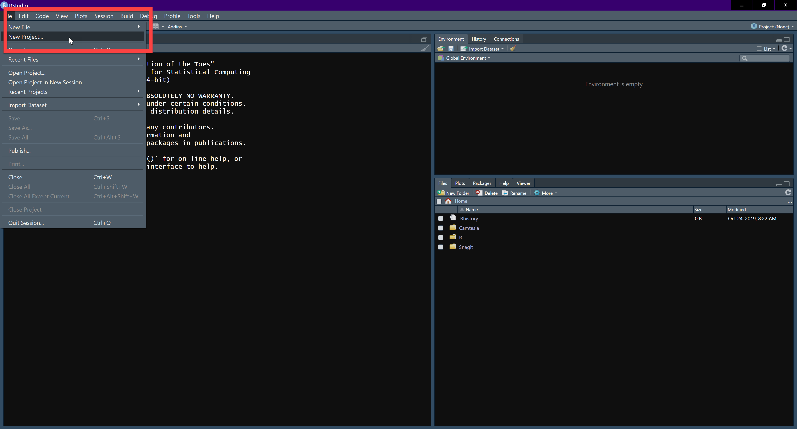

As an alternative, a new project can be created using the Create a Project button under the `Edit` drop-down menu:

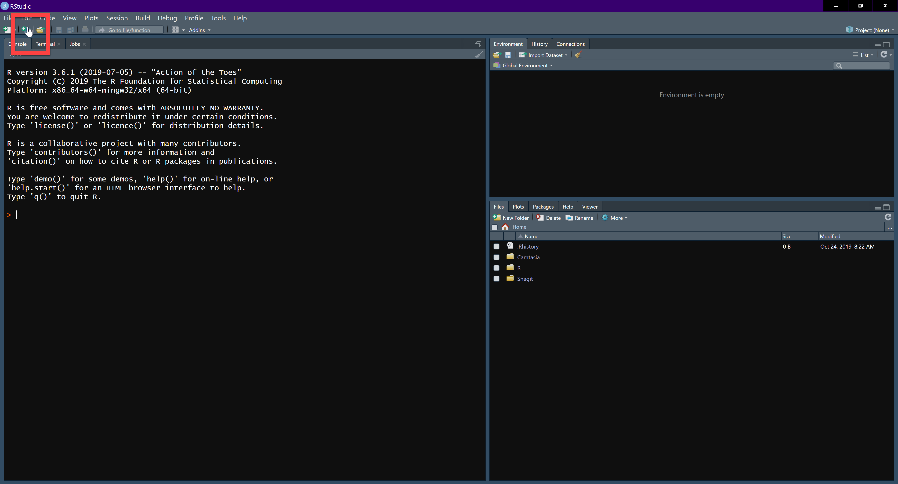

Or using the Projects menu near the right-top corner of the window:


We create a new project to initialize a package. This is done by choosing a new directory:

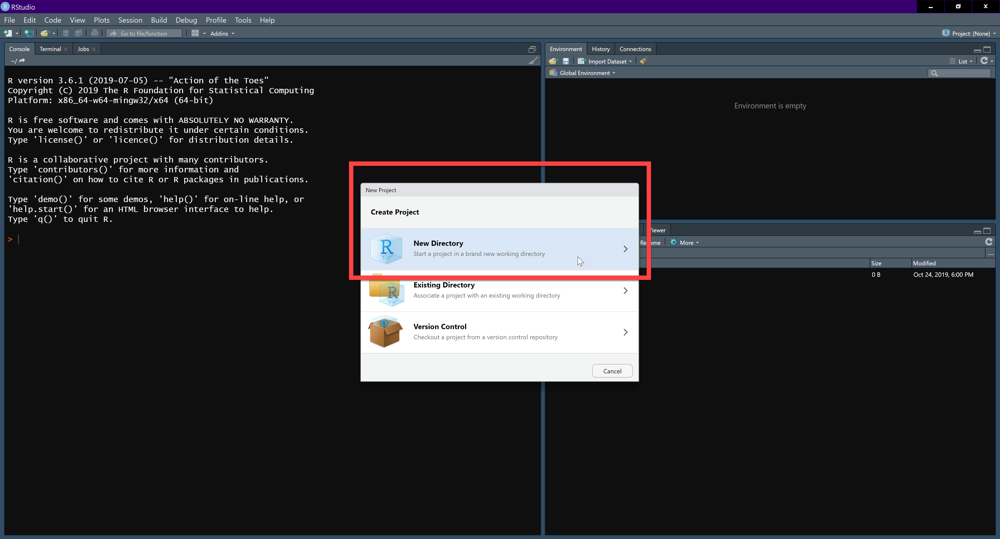

Notice that you can create different types of projects (a plain vanilla project, or an R package, or R packages with various additions, such as Rcpp, devtools, etc.) Each of these alternatives will initialize different packages and options for you. We will choose `Create a new R package`:

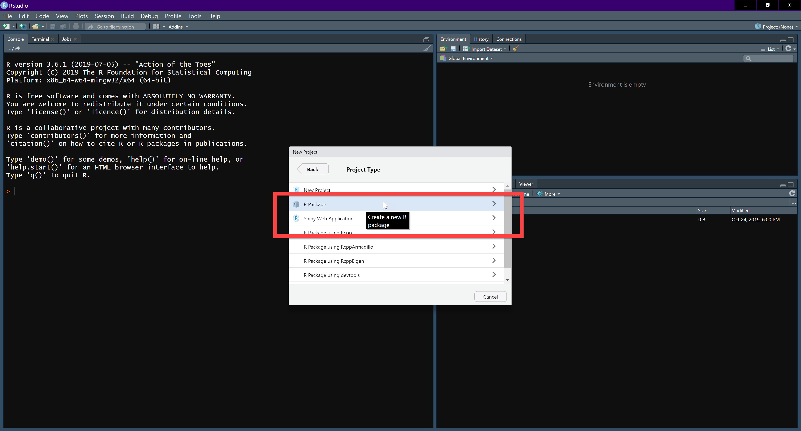

Choose the directory in your system where you want to create your project and package. This could be under a directory that already has version control, or version control can be added by clicking the tick box `Create a git repository`. You also need to give your package a name. Package names must include only letters, numbers, and periods (no other special symbols), and the use of periods is not advised because they can create confusion with file extensions:


For this example, I am going to call my first package `packr` (a quick Google search suggests that this name is not the name of an existing R package!). 

Once that you have created the project, there will be a directory with the following folders/files:


 
What are these? Lets take a look at some of the key components of the package.

### `DESCRIPTION`

A `DESCRIPTION` file was initialized with the package. This is a text file that includes some basic information about the package:

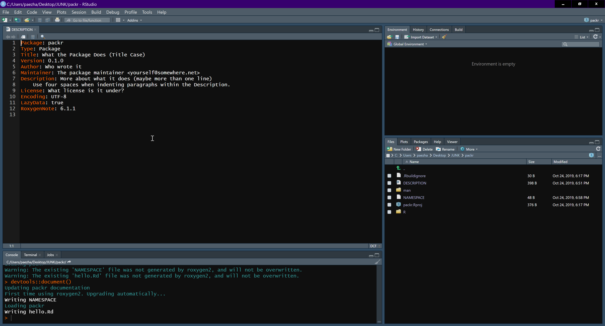

I am going to edit this file with specific information. This is a minimal description of the package, and there will be an opportunity to describe the package more fully elsewhere. For the time being, this is my `DESCRIPTION`:


### `R/`

In this folder will go all R code that you wish to include in the package. The folder was initialized with a `hello.R` function, a simple “Hello, world!” function. You can verify that it is there:

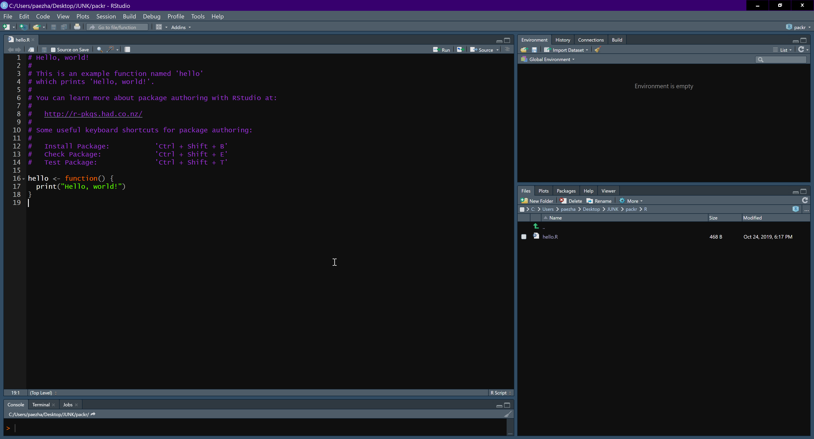
 
### `man/`

This is short for “manual”. In this directory will go the help files for the functions stored in R/. You can see that there is already a documentation file, for the function `hello.R`, in a file with the extension .Rd (for “R documentation”). Documentation is written in a syntax loosely based on LaTeX, and documentation files are rendered in different formats for ease of reading, including pdf, HTML, and plain text.
 
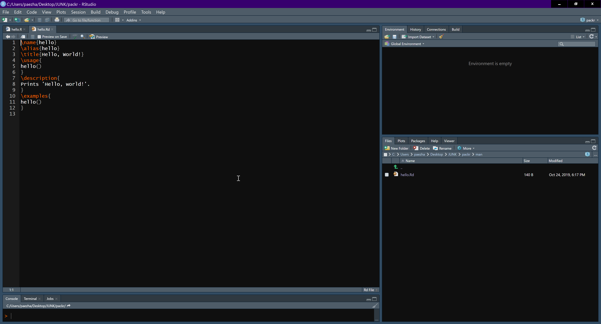

Writing documentation used to be one of the most tedious aspects of creating a package. Instead of writing these files by hand, a package called `roxygen2` can be used to create documentation. This package has several advantages over writing documentation manually:

- Code and documentation are linked, and if you change your code, you will be reminded to update your documentation files  
- The package creates a documentation template to work with, which saves time  
- It automates some aspects of documentation which makes the learning curve gentler  

Use of `roxygen2` means that you write your documentation directly in the script that contains your function, and this is translated into the syntax of `.Rd`.

Roxygen comments begin with `#'` to distinguish them from regular R comments. Notice the apostrophe! The sample function `hello()` that was intialized with my new package already had comments, but those were _regular R comments_. If I made changes to the description of the function and so on in the script, I would have to go and manually make changes in the corresponding `.Rd` file, and I do not want to do that.

Instead, I am going to convert the comments in the `hello()` function to make them roxygen comments:


To create `roxygen2` documentation, we use `devtools::document()`, which calls `roxygen2::roxygenize()` to do the hard work:
```
devtools::document()
```

Try this, and see what happens.

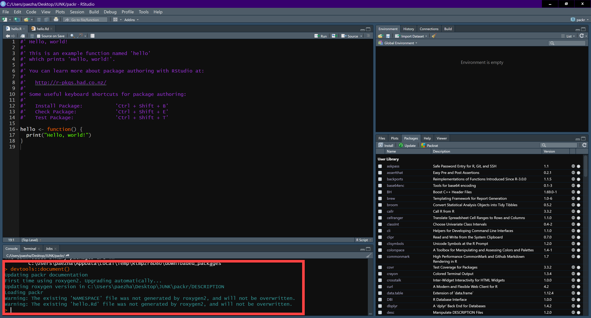

Oops! Some of the default documentation was not generated by `roxygen2` and will not be overwritten! So, what I will do instead is to delete the files that were not generated by roxygen2 and do all my documentation using this package (delete the files at this point).

Re-run `devtools::document()`:

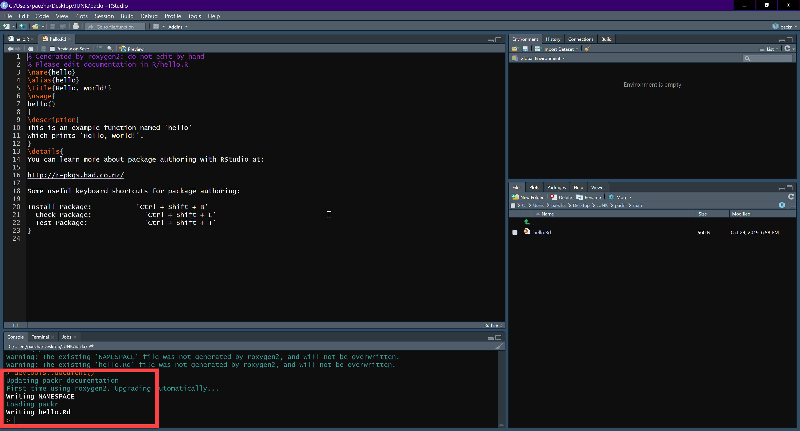

Now the documentation has been generated all using `roxygen2`, and there is a warning not to edit by hand! 

### Create an `R` script to document the package

We will add one more component to the package at this point, an `R` script to document the package. Create a new script, for instance by using the drop-down menu `File > New File > R Script`:

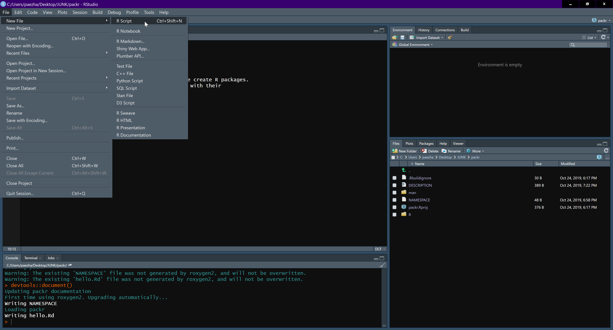

The name of the new script should be the same as the name of your package, so in this case it will be `packr.R`.

This script will consist only of comments, as follows (notice that the comments are in `roxygen2` style):
```
#' packr: A package with a minimum example of package creation.
#'
#' This package was created as an exercise in package creation
#' using R studio. The package includes a sample function and 
#' a sample dataset with their respective documentation.
#'
#' @docType package
#' @name packr
NULL
```

We use the symbol `@` for tags. In the example, there are two types of tags in use: `docType` (package) and `name` (packr). There are many other tags that can be used to describe different aspects of a package, function, or dataset, and if you begin a comment in the script with `@` suggestions for tag will pop up for you:

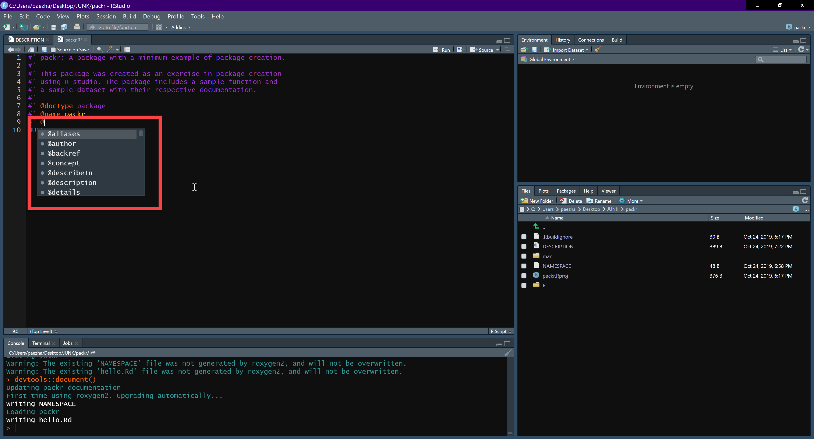

Now proceed to generate the documentation:
```
devtools::document()
```

### Build the package

The components above constitute a minimal package. Now, we are ready to _build_ the package, that is, convert it from a collection of files into a proper, distributable bundle. Again, we can do this from the command line, or we can do this in R Studio using the `Build` tab:


This tab includes a number of options to work with packages, including nstalling a package and restarting the R Studio session, testing the package, building the package, cleaning and rebuilding, etc. See below:

![Package building actions]

We can begin by _checking_ the build, to make sure that there are no errors This will run an extensive set of diagnostics to reduce the risk of a package not working or having other issues:


(Notice the warning to install Rtools).

Having found no warnings and no errors in the diagnostics, it is possible to _build_ the package. This is done by building a _source_ package, the alternative being building binaries (which are for users who lack the development tools, but since those are readily available I do not see much point to it):

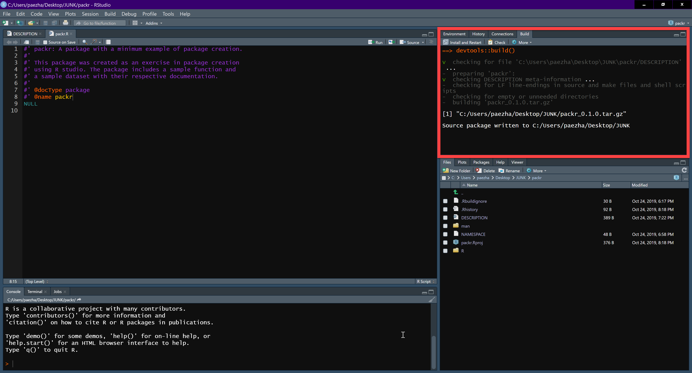


This will generate the documentation for the functions in the package. Next, try:
```
?hello
```

This should display the help file.
Try now with a new function. A simple function could be:
```
multiply <- function(a, b){
a * b
}
```
Save this as R script `multiply.R` in the R/ folder.
Add roxygen comments to the script. Roxygen comments begin with “#’” to distinguish them from regular comments.
For example:
```
#' Multiply two numbers
#'
#' @param a A number
#' @param b A number
#' @return The product of \code{a} and \code{b}
#' @examples
#' multiply(2, 5)
#' multiply(4, 8)
multiply <- function(a, b){
  a * b
}
```
Run `devtools::document()` again. Navigate to your man/ folder, and you will see that there is a new documentation file for the function. Also, notice that this file cannot be edited manually – it is linked to the source script, which 1) save you having to work twice; and 2) ensures that you don’t lose track of documentation files.
 

As an alternative:
 

## Document package
Create an R script with the name of the package. This will consist only of comments:
```
#' ModeDissonanceSantiago: A package with the data used in the analysis of mode dissonance in Santiago, Chile; it also includes one utility function for cross-tabulations.
#'
#' The ModeDissonanceSantiago package includes the following dataset:
#' Mode_Dissonance_Santiago.RData
#'
#' It also includes the following function used to create cross-tabulations: 
#' crosstabs.R
#'
#' @section Foo functions:
#' The foo functions ...
#'
#' @docType package
#' @name ModeDissonanceSantiago
NULL
```
Rerun `devtools::document()` and check the documentation by typing `?ModeDissonanceSantiago`.

Create a data\ folder in your package directory.

### .Rbuildignore
It tells R which items to ignore when building the package. These items will not travel with the package. Useful to keep items that are not for sharing or are not necessary for the package confidential.
For example, to create a private folder, use:
```
usethis::use_build_ignore("yourfolder")
```
In my case, I created a raw\ folder where I plan to put my raw data.
Copy any data files (or other documents) that are not meant to be shared into this folder.
Once that the data file (or files) have been copied to the data\ folder, it is possible to create data documentation. 
This is done initially in the R script with the documentation for the package, in the present case `ModeDissonanceSantiago.R`.
Documentation there looks like this:
```
#' Primary mode of travel and modes associated with affective values.
#'
#' A dataset containing information about 451 travellers in Santiago, Chile,
#' including their primary mode of travel and the mode or modes that they
#' associate with several affective  and instrumental values.
#'
#'
#' The modes of transportation (USED, FREEDOM, ENJOYMENT, HAPPINESS, POVERTY, LUXURY, STATUS, SAFETY, TIME, EFFICIENCY) are coded as:
#'
#'  \itemize{
#'     \item "A": Car
#'     \item"B": Taxi
#'     \item"C": Colectivo
#'     \item"D": Moto
#'     \item"E": Metro
#'     \item"F": Bus
#'     \item"G": Bicycle
#'     \item"H": Walk
#'}
#'
#' AGE is coded as:
#'
#'\itemize{
#'     \item"A": Less than 18 years
#'     \item"B": 18 to 24 years
#'     \item"C": 25 to 34 years
#'     \item"D": 35 to 54 years
#'     \item"E": 55 to 64 years
#'     \item"F": 65 and older
#'}
#'
#' EDUCATION is coded as:
#'
#'\itemize{
#'     \item"A": ELEMENTARY
#'     \item"B": SECUNDARY
#'     \item"C": PROFESS_TECH
#'     \item"D": COLLEGE
#'     \item"E": POSTGRAD
#'}
#'
#' INCOME is coded as (in pesos):
#'
#' \itemize{
#'     \item"A": Less than 423
#'     \item"B": 423 to 639
#'     \item"C": 639 to 977
#'     \item"D": 977 to 1550
#'     \item"E": 1550 to 2380
#'     \item"F": More than 2380
#'}
#'
#' TRAVEL_TIME is coded as:
#'
#' \itemize{
#'     \item "A": 0-20 min
#'     \item"B": 20-40 min
#'     \item"C": 40-60 min
#'     \item"D": 1h and more
#'}
#'
#' @format A data frame with 451 rows and 24 variables:
#' \describe{
#'   \item{NUMERO}{Respondent ID}
#'   \item{USED}{Main mode of transportation used by the respondent}
#'   \item{FREEDOM}{Mode(s) that the respondent associates with feelings of freedom}
#'   \item{ENJOYMENT}{Mode(s) that the respondent associates with feelings of enjoyment}
#'   \item{HAPPINESS}{Mode(s) that the respondent associates with feelings of happiness}
#'   \item{POVERTY}{Mode(s) that the respondent associates with feelings of poverty}
#'   \item{LUXURY}{Mode(s) that the respondent associates with feelings of luxury}
#'   \item{POVERTY}{Mode(s) that the respondent associates with feelings of status}
#'   \item{SAFETY}{Mode(s) that the respondent associates with feelings of safety}
#'   \item{TIME}{Mode(s) that the respondent associates with feelings of wasted time}
#'   \item{EFFICIENCY}{Mode(s) that the respondent associates with feelings of efficiency}
#'   \item{AGE}{Mode(s) that the respondent associates with feelings of efficiency}
#'   \item{EDUCATION}{Mode(s) that the respondent associates with feelings of efficiency}
#'   \item{INCOME}{Mode(s) that the respondent associates with feelings of efficiency}
#'   \item{TRAVEL_TIME}{Mode(s) that the respondent associates with feelings of efficiency}
#'   \item{WEIGHT_*}{A weight for the responses by affective or instrumental value.
#'   Some respondents selected more than one mode that they associated with feelings of
#'   {FREEDOM, ENJOYMENT, HAPPINESS, POVERTY, LUXURY, STATUS, SAFETY, TIME, and EFFICIENCY}.
#'   To avoid giving greater weight to respondents who indicated several modes of
#'   transportation, a weight was calculated that is the inverse of the number of
#'   modes indicated. These weights can be used to weight the frequencies prior to
#'   any analysis. For example WEIGHT_FREEDOM will be inversely proportional to the
#'   number of modes that a respondent named with respect to feelings of freedom}
#' }
#'
#' @docType data
#' @keywords datasets
#' @name Dissonance_Santiago
#' @usage data(Dissonance_Santiago)
#' @source Beatriz Mella Lira
"Dissonance_Santiago"
```
The package can be built/rebuilt and/or the documentation recreated. This will add the documentation of the dataset.
## Vignette
A vignette is a document that illustrates how to use a package. A vignette is initialized as follows:
```

```
Note that the vignette will only load when the package is installed from the tar.gz file, that is, if you try to `browse_vignette()` after building the package, it will not show.


### Activity

1. Create a new R Markdown file, name it "Your Name Activity 1"

2. Create a level-1 header and write in less than 200 words what is your main research interest. Use formatting for emphasis as appropriate.

3. Create a new level-1 header and type "Favorites"

4. Under this header, create a level-2 header "Favorite Music". Create a numbered list with your 5 favorite songs.

5. Still under favorites, create a new level-2 header "Favorite Equation" and type your favorite equation

6. Still under favoritesm create a new level-2 header "Favorite Artists" and create a table with two columns "Name" and "Achievements". Populate the table with 5 favorite artists.

7. Create a new level-1 header and type "A Chunk of Code". Under this header create a chunk of code, whatever you want R to do immediately for you.

8. Once you have done this, knit your document to PDF and email to both instructors.

### Suggested readings

Parker, H. (2014) [Writing an R package from scratch](https://hilaryparker.com/2014/04/29/writing-an-r-package-from-scratch/)  

Broman, K. (n.d.) [R package primer: a minimal tutorial](https://kbroman.org/pkg_primer/)  
  
Wickham, H. (2015) [R packages: organize, test, document, and share your code](http://r-pkgs.had.co.nz/). O'Reilly Media.  
  
Khanal, A., and Khanal, S. (2018) [Building R packages](https://rstats-pkgs.readthedocs.io/en/latest/index.html#)

