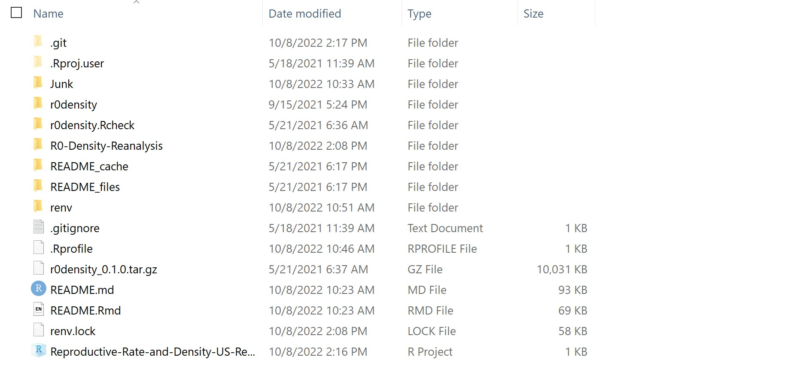
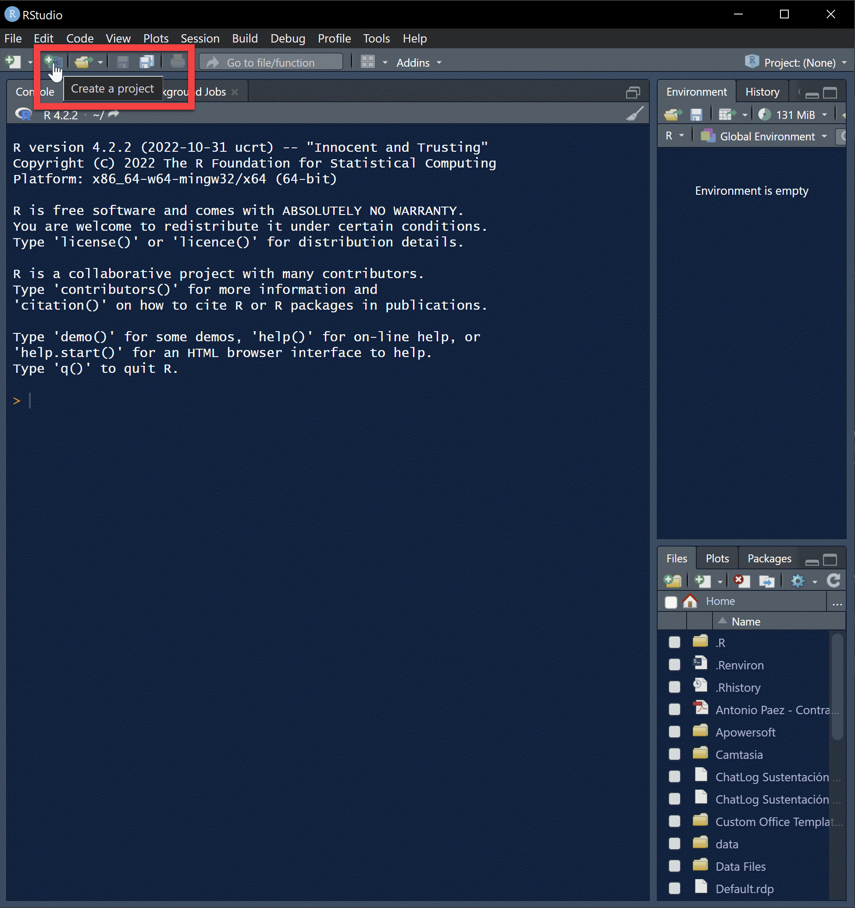
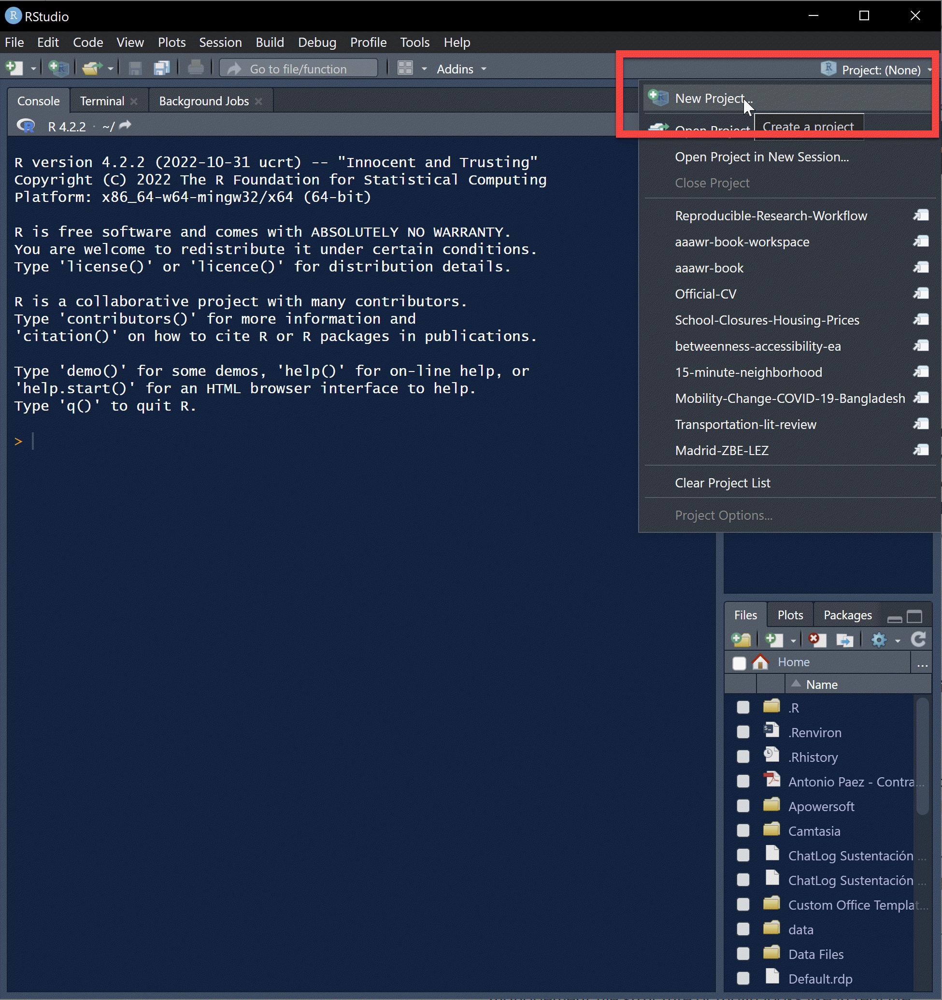
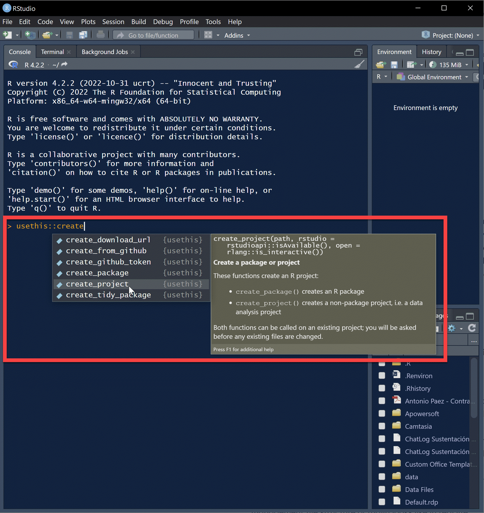

# GEOG 712 Reproducible Research

## Session 3. Projects and Reproducible Environments

### What is a project

A project is a convenient way of organizing and separating independent pieces of works.

A project can be as simple as a small report, a research paper, or as large as a thesis or a book. It can also be an ongoing activity like a blog. 

Projects implement a _pyramid_ folder structure: the top folder houses the whole project, and then folders are created to hold assets, possibly by category. 

Here are some examples of projects with their folders:  
  
  
    
  
  
  
### Creating a project

There are several ways to create a project, using the GUI or the command line:

  
  
  
  
  
  
Go ahead, create a project. The project initially consists simply of an Rproj file, which stores the information relevant to the project (the project settings).  
  
From here, you can begin adding assets to the project. What "assets" do you anticipate having?  

Create some mock assets.

## Packages

Packages are units of shareable resources (typically code, data, documentation, etc.) that add functionality to base `R`. They are created by developers around the world who need them to solve specific problems, and many of them are shared through archive network(s) or repositories.

Try installing the following packages:

- [{here}](https://here.r-lib.org/)
- [{renv}](https://rstudio.github.io/renv/)
- [{usethis}](https://usethis.r-lib.org/)

You can do this by using the `Packages` tab or the command line, for example:  
```
install.packages("here")
```

The packages will be placed in your global library in your machine.

### Package [{here}](https://here.r-lib.org/)

All the materials that are relevant to your project live in the project folder, but they will likely be located in subfolders in a pyramid structure. Package {here} makes it easy to refer to them by recording the location of the project folder. References to files are _relative_ to the project folder.

Example of an absolute path:  
```
C:\Antonio\Courses\Reproducible-Research-Workflow\Session-03-Projects-and-Reproducible-Environments
```
  
Example of a relative path:  
```
{here}\Session-03-Projects-and-Reproducible-Environments
```

Besides making it easier to find your files in a project, the use of relative paths also:

- Makes it easy to change projects to different folders if and when needed  
- Facilitates collaboration, since not all participants in a project will have the same names for their computers, folder, etc.   
  
### Reproducible environments

`R` and most packages evolve all the time, and therefore there will be at any time a number of versions of `R` and any given package. Check for example the archive of {ggplot} [here](https://cran.r-project.org/src/contrib/Archive/ggplot2/).

This means that some functions will change, some will be added, some will disappear. This can have important implications for a project: what used to work, may not work any more, which is obviously a problem for repeatability and reproducibility. This can be an obstacle to collaboration as well, if various collaborators have different versions of `R` or of the packages required by the project.

To address this, reproducible environments provide functionality to isolate package libraries and to make them portable.

Let us recreate the project, now using a different method from the one you used before (rename or delete your previous project). Now, we will initialize a reproducible environment, for instance from the command line:  
```
renv::init()
```  
  
When a reproducible environment is created three things happen:

- A project profile is created: this file is ran automatically when the project is launched and configures `R` to use a _local library_ (instead of your global library)  
- A lock file is created to record the packages used in the project, including their versions and sources  
- A folder to keep your local library is created  
  
The reproducible environment can be modified (for instance to install packages or update them).  The environment can be _restored_ to return the library to the state currently recorded in the lock file. A _snapshot_ rewrites the lock file with any changes to the packages (i.e., updates and installs).

A reproducible environment is portable, which means that it can be used by yourself in a different machine, or by others, while reducing the risk that the project will break due to differences in versions of the software.  
  
### Activity

1. Create a project and initialize a reproducible environment

1. Install packages {here}, {usethis}, {annotater} and review the status of the environment with `renv::status()`. Do a snapshot as appropriate.

1. Use `usethis::use_readme_rmd()` to create an Rmarkdown file for your README

1. Transfer the contents of the file in your Activity 1 to your README.Rmd file and knit

1. Add some assets to your project (a data table, an image, etc.) Use folders to organize these assets

1. Add a section to your README.Rmd to explain what goes where in your folder structure

### Suggested readings

[What is version control?](https://intro2r.com/rsprojs.html)  
[{here}: a package for projet oriented workflows](https://here.r-lib.org/)
[{renv}: a package for reproducible environments in `R`](https://rstudio.github.io/renv/index.html)  
