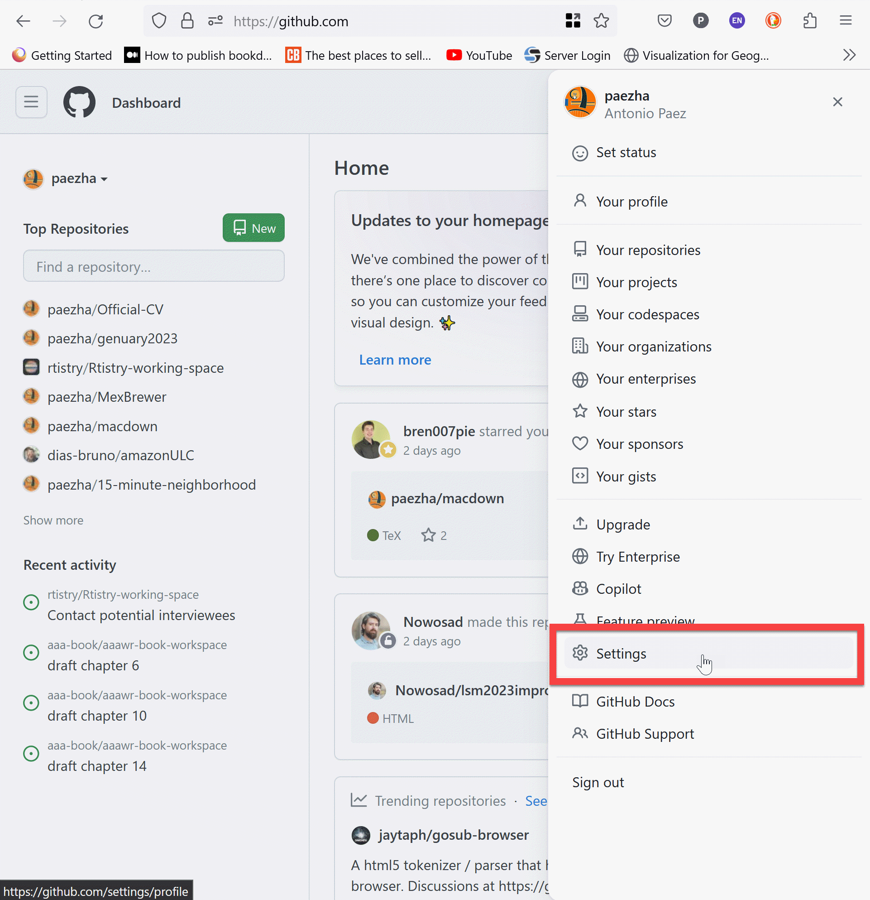
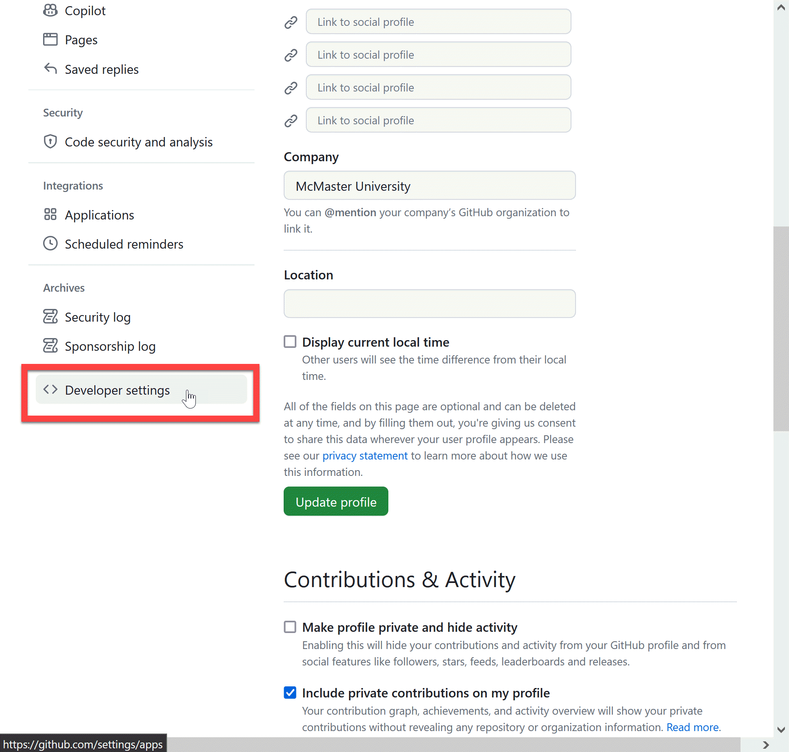
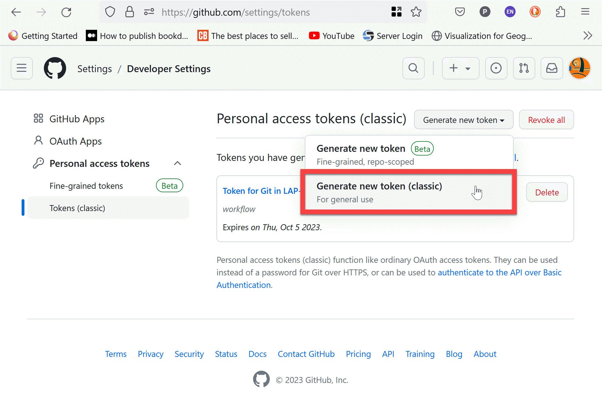
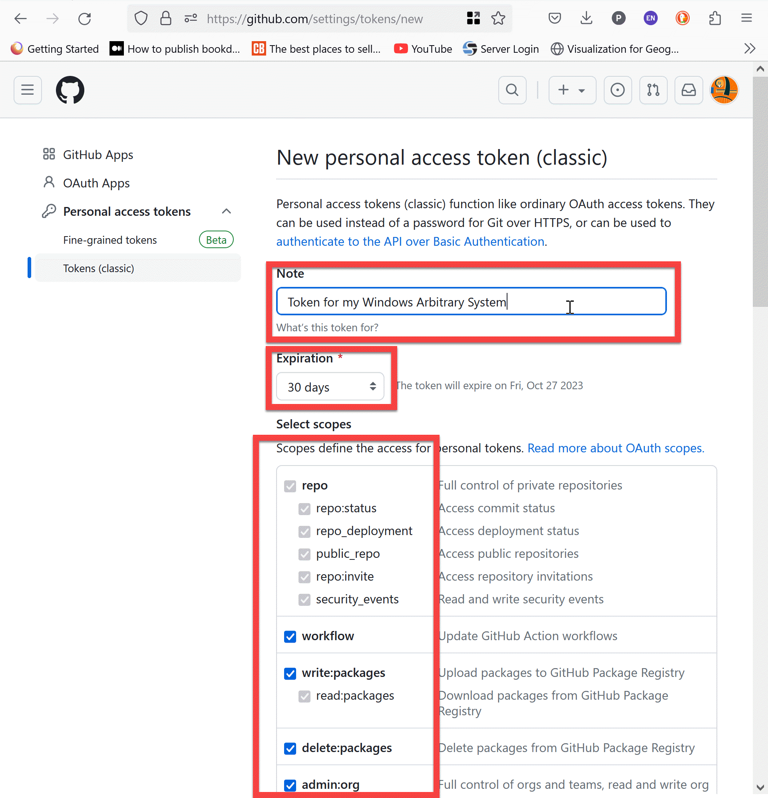
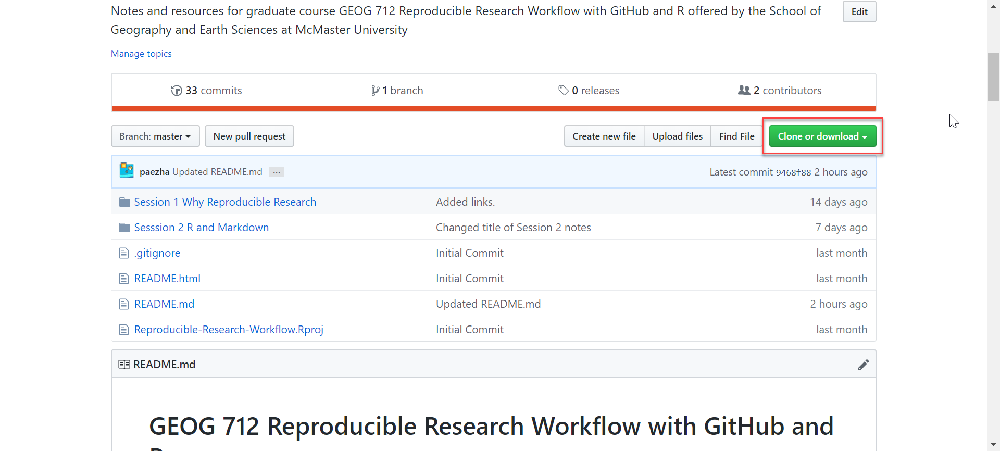
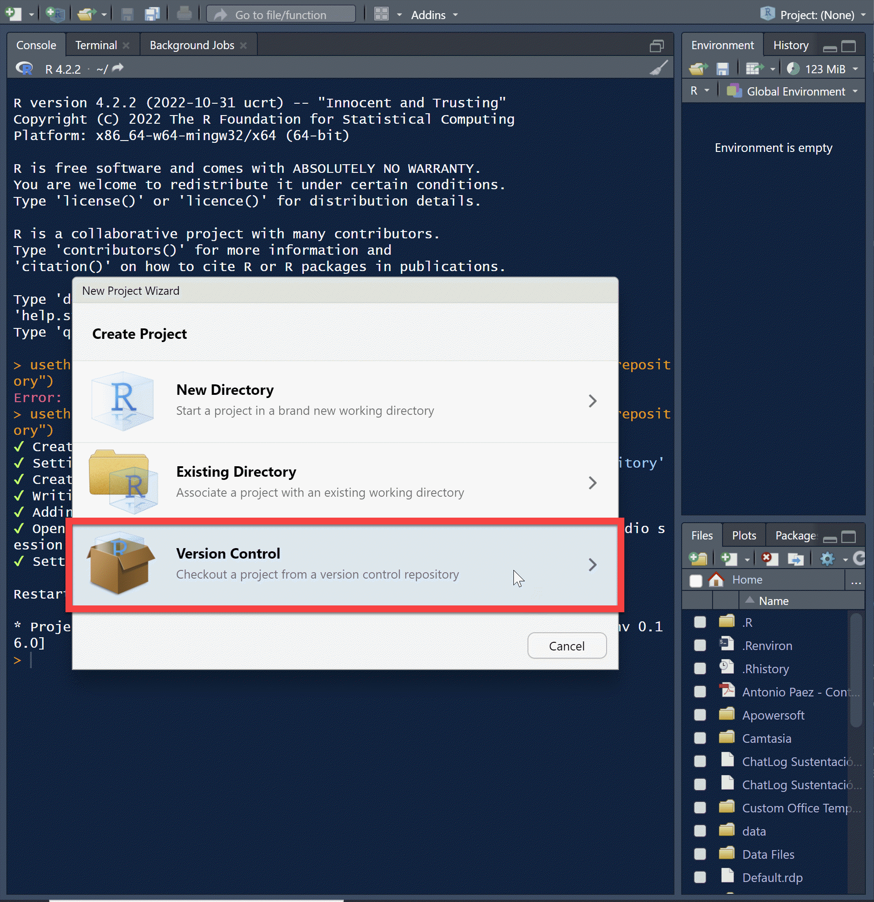
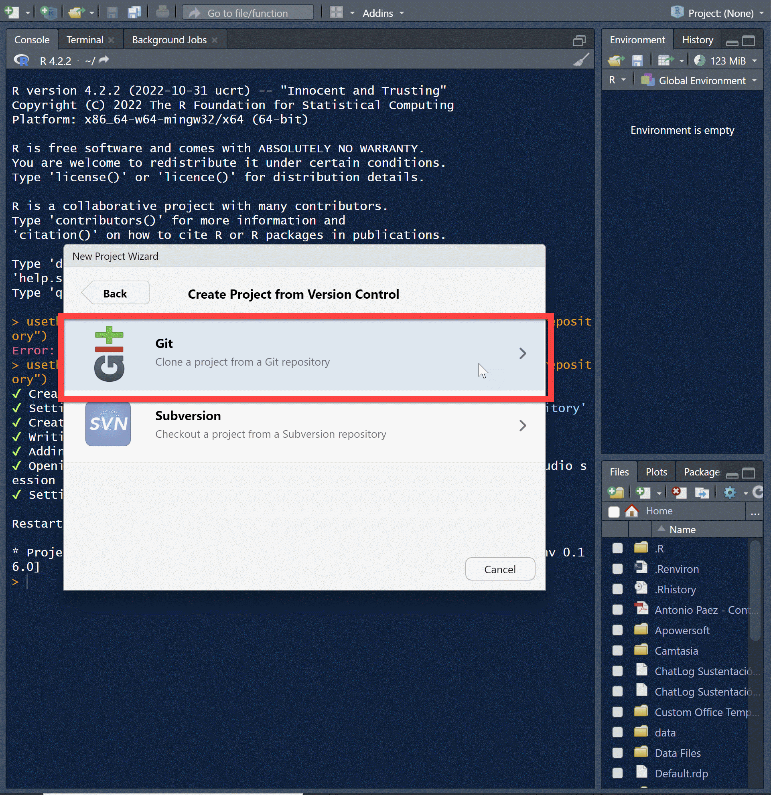
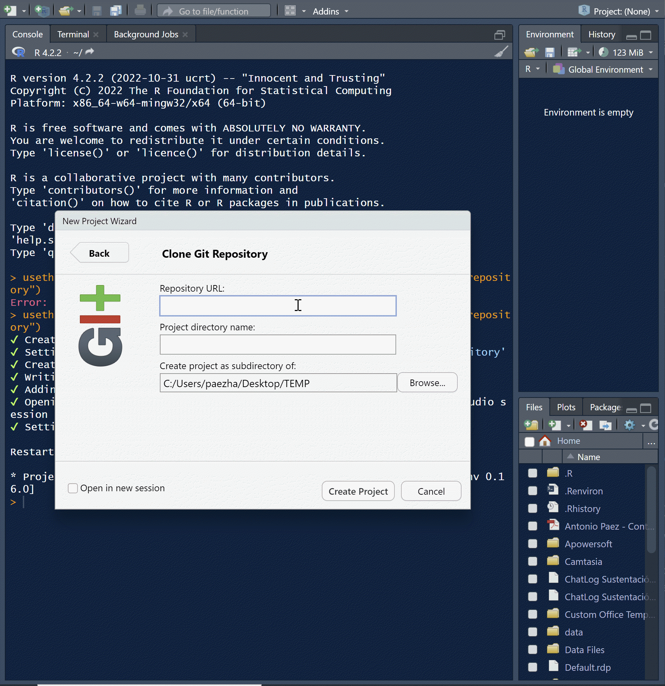
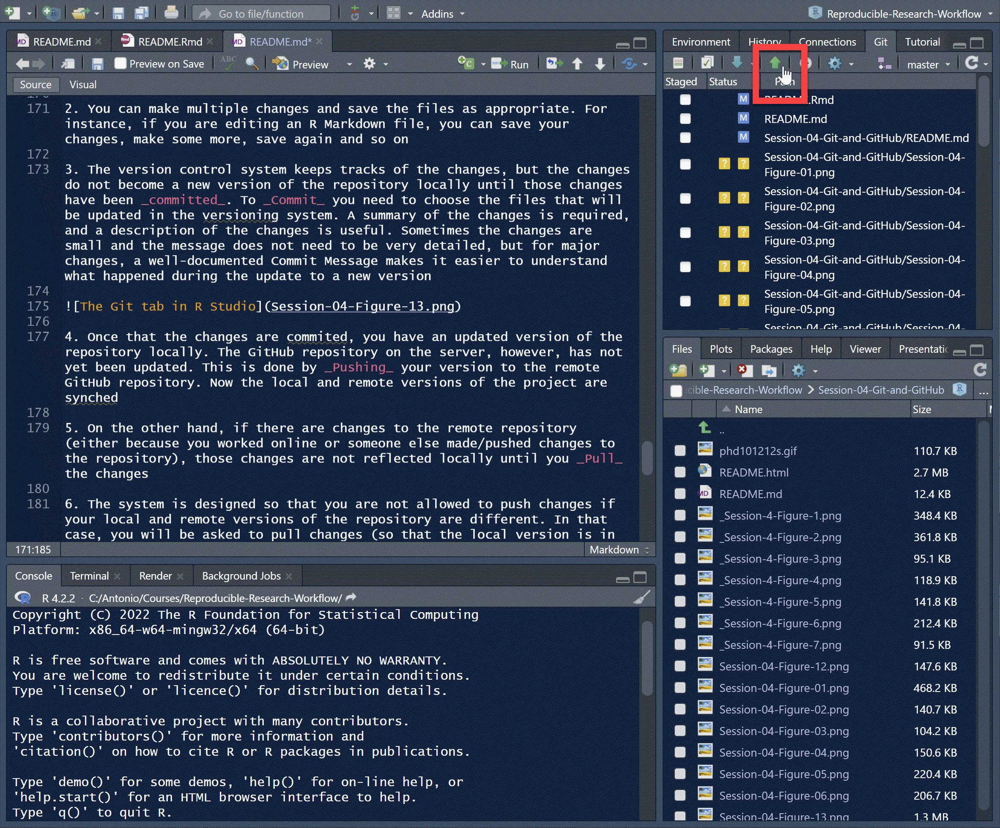

# GEOG 712 Reproducible Research

## Session 3. Version Control and Github

### What is version control

Version control is a system to systematically record changes to files in a project, in such a way that it is always possible to recall specific versions of the files at any point in the life of the project. 

There are different reasons why version control is a valuable tool in reproducible research.

Having versions of a project is useful because it prevents error propagation. For instance, if changes are made in a coding project that introduce error (e.g., the analysis fails, the code breaks, etc.), it is always possible to retrieve files from a previous version before any questionable changes were completed.

Version control also allows projects to grow. For instance, there might be some common elements in different projects, say, data preprocessing, after which analysis can differ. Version control would allow multiple projects to branch from that common root with ease.

Version control can be done locally. 

In this case, files are stored in a local system and are identified by versions. The user can select which version to work with. A very simple way of doing version control is by naming files according to progression. Many of us will call a file "Document-Sept-19-2019", and then when we work on it again and make changes, save the new file as "Document-Oct-15-2019". This is a rudimentary and inefficient way of doing version control, given the proliferation of files and the difficulty of keeping track of changes.


Version control systems instead keep a database of files by version, while keeping track of changes.

Version control systems can also be centralized.

In this case, there is a version control server that serves versions of the project to one or more users, who also keep the project locally in their systems. An advantage of a centralized version control system is that it automatically provides backup for the project in the server. Another advantage is that a centralized system also makes it easy to collaborate with others - there will be more on this at a later session. 

In this session we will introduce some basic concepts and tools of version control.

### Software

Version control is implemented in a systematic way by different software applications. They include [PerForce](https://www.perforce.com/solutions/version-control), [Mercurial](https://www.mercurial-scm.org/), and [Bitbucket](https://bitbucket.org). For this seminar, we will use GitHub, a centralized version control system based on Git.

#### Git

[Git](https://en.wikipedia.org/wiki/Git) is a version control system that was created by Linus Torvalds (of Linux fame) after the source-control management system that he and his collaborators had been using during the creation of the Linux kernel.

[Git](https://en.wikipedia.org/wiki/Git_(slang)) in British English slang means a contemptible and unpleasant person, and without much [argument](https://www.youtube.com/watch?v=xpAvcGcEc0k) Torvalds called the project "the stupid content tracker". Git, like Linux, is an open source free project.

#### GitHub

GitHub is a hosting service for version control based on Git. It implements the functionality of Git and complements with additional features. As of 2019 it is reported to have 38 million users and at least 28 million public repositories, which makes it the world's largest host of source code - althought source code is only one class of information that GitHub serves.

For this seminar you will need to create an account with [GitHub](https://github.com/join?source=header-home). An account can be created for free which offers full functionality using public repositories. A GitHub Pro account is needed in order to keep private repositories, but for the purpose of this seminar you do not need it.

If you do not have an account yet, please create one now.

### Set up

Now that you have a GitHub account you can set your system up so that it can communicate with GitHub.

Go to your profile icon and navigate to "Settings".



Once there, navigate to "Developer Settings".



Choose "Tokens (Classic)". A token is an identification tool.


Choose the option to generate a new token. I usually generate a token for each of my systems (e.g., my laptop, my desktop, etc.) but it is possible to generate finer grained tokens that are specific to a repository. I have not yet seen the need for that in my work. 




The note allows you to use text to remind you that this token is for. I set the expiration to 30 days so that I must regenerate the token frequently. This is good for security, but for me it is also important to keep the process fresh in my memory.



The scopes are the permissions that this token grants: can it manipulate repositories? can it delete them? And so on. Go on, give this token all permissions, but remember that it is very important that you keep the token safe and you don't share it or otherwise allow it to become compromised.

Your new token will be displayed. You can copy it and use it to authenticate your system.


To authenticate your system, go to R Studio. You will need package [{gitcreds}](), which handles git credentials from `R`. Use:
```
gitcreds::gitcreds_set()
```

And choose the option to set or replace your credentials. At the prompt, paste the token that you generated on GitHub. Now GitHub will know that this system is allowed to interact with it in your name. Remeber to navigate away from the GitHub page where your token was displayed.

### What happens after thirty days? (Or whatever period you chose for your token to expire)

Once you have a token, you basically can regenerate following the steps above: navigate to "Settings" > "Developer Settings" > "Tokens (Classic)" and then choose the token you wish to regenerate. Then use `gitcreds::gitcreds_set()` to replace the previous token with the new one.

### So what can we do with a version control system?

Let us quickly tour GitHub.


#### Creating a repository

The starting point for using version control is to create a repository. You can do this directly on GitHub:


You will need to choose a name for the repository and select the settings. See below:


The settings allow you to create a README.md document immediately, so that the repository is not empty.


As an alternative, you can do this from R Studio. After creating a project, use `usethis::use_git()` and `usethis::use_github()`. The first function will initialize a repository locally. The second will push it to GitHub.

#### Making and committing changes using the online editor

Any text files can be edited directly using the online editor:


#### Review the history of a repository


#### Review version changes


### You can also be a little bit social using version control

Git and GitHub encourage interaction with and between creators and developers.

#### Fork a repository

A _fork_ is an original copy of a repository that can be used to experiment with changes without those changes being reflected in the original project. Forks are a practical way of using some project as the starting point to develop your own ideas. Forks can also be used to propose changes to the original project - for instance improvements or bug fixes.


Try forking this repository: https://github.com/paezha/Reproducible-Research-Workflow

#### Clone a repository

When a repository is created on GitHub, it first only exists remotely. To create a copy locally, you must _clone_ the repository. You can clone any public repositories, including obviously your own.



To start a project from a repository on GitHub navigate to "New Project" and choose to create it from "Version Control":





Here, you can use the URL of the repository you wish to use for the project:



#### Work on a project  

In your forked repo edit the following table to include your name and program:

Student Name | Last Name | Program
-|-|-
Claire | Estey | Biology
Niloofar | Nalaee | Geography
Ricardo | Barros Lourenco | Geography
Anastasia | Soukhov | Geography
Daniel W.| Van Veghel | Geography 
Elise | Desjardins | Physics
Jaila | Shamal | Geography
Ritchie | Lee | Chemistry
David | Ma | Chemistry
Megeen | Magee | Geography
John | Merrall | Geography
Sears | Sean | Geography
Rajveer | Ubhis | Geography
Tatiane | Ferrari | Economics
Fernando | Romero | Engineering
Sadia | Tasnim | Engineering
Almodather | Mohamed | Civil Engineering
Emilie | Diesbourg | Biology
Noah | Britt | PNB
Elizabeth | Phillips | PNB
Claire | Gillespie | Chemistry
Athena | Flores Miranda | Medical Sciences 
Haoran | Xu | Geography
Zaineb | Hamoodi | Chemical Biology
Liam | Surry | Chemical Biology 
Zehui | Yin | Geography

#### I am creating conflict

A conflict! Conflicts are fun! But I am also writing something else here.

### Hi :)

Hope you all have a good day!

#### Workflow
Serenity is the way of the sage
The workflow with GitHub Desktop, once you have cloned a repository, is as follows:

1. Make changes to your project (i.e., edit files, create new files, delete files, etc.)

2. You can make multiple changes and save the files as appropriate. For instance, if you are editing an R Markdown file, you can save your changes, make some more, save again and so on

3. The version control system keeps tracks of the changes, but the changes do not become a new version of the repository locally until those changes have been _committed_. To _Commit_ you need to choose the files that will be updated in the versioning system. A summary of the changes is required, and a description of the changes is useful. Sometimes the changes are small and the message does not need to be very detailed, but for major changes, a well-documented Commit Message makes it easier to understand what happened during the update to a new version


4. Once that the changes are commited, you have an updated version of the repository locally. The GitHub repository on the server, however, has not yet been updated. This is done by _Pushing_ your version to the remote GitHub repository. Now the local and remote versions of the project are synced



5. On the other hand, if there are changes to the remote repository (either because you worked online or someone else made/pushed changes to the repository), those changes are not reflected locally until you _Pull_ the changes

6. The system is designed so that you are not allowed to push changes if your local and remote versions of the repository are different. In that case, you will be asked to pull changes (so that the local version is in sync) before pushing any changes

7. The system will try to complete all changes seamlessly - but conflicts can happen! We will discuss conflicts in a later session when we talk about collaboration in more detail  

#### Request a pull

When you wish to suggest changes to the owner of the repository, you can request a pull. It is up to the owner to accept the request or not.

For example, after pushing the changes to your forked repository, you request a pull for your edits.

### GitHub Desktop

Instead (or in addition) to credentialling your system with GitHub from `R` account, you can use an app called GitHub Desktop, which can be downloaded [here](https://desktop.github.com/). This app allows you to interact with GitHub from your local system.
  
### Activity

1. Create a new R Studio project and name it "my-GEO712-repository"

2. Initialize a reproducible environment and install packages as needed

3. Use package {usethis} to initialize git for the repository (`usethis::use_git()`) and then set it up to work with GitHub (`usethis::use_github()`)

4. Create a README.Rmd file (`usethis::use_readme_rmd()`) and transfer the contents of your previous activity. Alternatively, copy the file to this repository

5. Use R Studio to edit the README.Rmd file; use markdown syntax to introduce your repository (don't forget to knit when you are done) 

6. Commit your changes, and then push them to the GitHub repository

7. Once you have done this, go to GitHub and in the repository settings look for "Collaborators". Invite me to collaborate (my GitHub handle is `paezha`)  

### Also for next week: 

Please sign-up for a DMP Assistant @ https://assistant.portagenetwork.ca/?locale=en

### Suggested readings

[Data Science Training for the Arctic Data Center - Introduction to R and R Markdown](http://training.arcticdata.io/materials/arctic-data-center-training/version-control-with-git-and-github.html)

[GitHub Hello World Project](https://guides.github.com/activities/hello-world/)

[{gitcreds}: a package to query git credentials from `R`](https://gitcreds.r-lib.org/)

