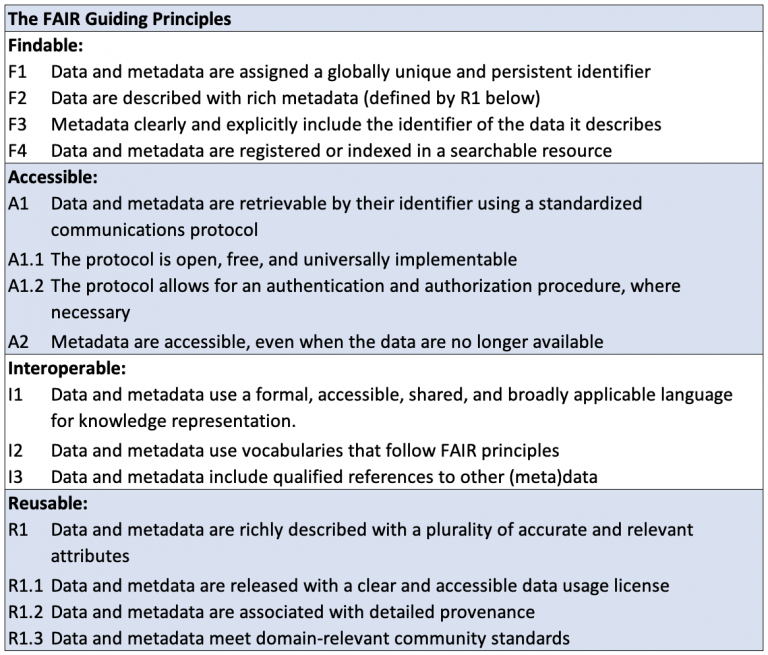
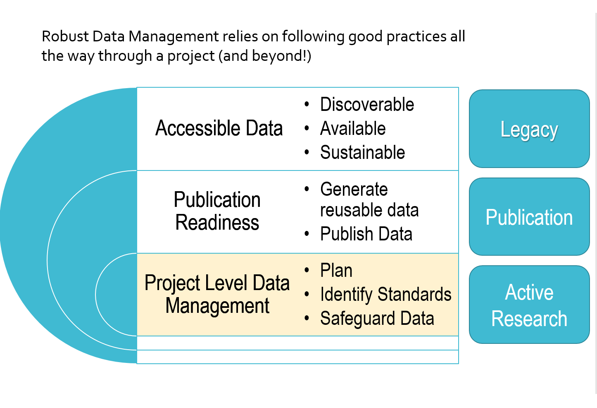
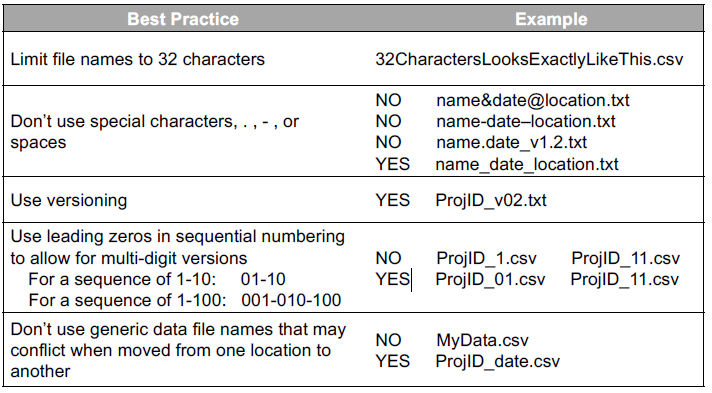

# GEOG 712 Reproducible Research

## Session 4.  Research Data Management Principles

## What is Research Data Management (RDM)?

From the [McMaster Research Office for Administration, Development and Support (ROADS)](https://roads.mcmaster.ca/research-data-management-at-mcmaster) website:

> RDM is the active organization and maintenance of data throughout its lifecycle, from its collection, interpretation, dissemination, and the archiving of valuable results. RDM enables reliable verification of research results, and permits innovative, interdisciplinary research built on existing information. The application of RDM improves cumulative research efficiency, and reduces the overall cost of research

## Key Notions

 - Active
 - On-going (Throughout the research process)
 
 **Add:** 
 - Best Practices and Standards

## The Case for RDM?

[Data Sharing and Management Snafu in 3 Short Acts](https://www.youtube.com/watch?v=N2zK3sAtr-4)

### Who Benefits from Research Data Management?

- **You and your Collaborators**:  Setting up processes and standards for how you collect, document and organize your data will mean that you spend less time on data management over the course of your research.  You will spend less time searching for files and trying to "figure things out" when you have properly managed your data.  Collaborators (including your future self) will have an easier time understanding and using the data too!  Additionally, getting data to a point where it is accessible by others will increase impact and citations.

- **Journals**:  RDM practices make it easier to compile and provide the supporting data that many journals now require alongside submitted articles.  Provision of data is critical to reproducability and credibility.  

- **Funders**:  Funding agencies, particularly public funding agencies are under pressure to increase their accountability and show value for their investment in research.  They also understand that data that is discoverable/reusable may prevent duplication of effort and accelerate new research. 

- **Science/Body of Knowledge**:  Well managed data will be discoverable, accessible and understandable making it ultimitely reusable for new science or study!  

## Drivers of RDM - Data as a Research Output

### 1. Funder Policy:
The policies of funding agencies around the world have increased their focus on data management in recent years.  In Canada, the Tri-Agency (SSHRC, NSERC, CIHR) have great influence. The following Tri-Agency policies highlight expectations for RDM excellence.

### **[Tri-Agency Statement of Principles on Digital Data Management (TASPDDM)](http://www.science.gc.ca/eic/site/063.nsf/eng/h_83F7624E.html?OpenDocument)**: Promotes excellence in digital data management practices and data stewardship in agency-funded research

**Expectations:**

- Data Management Planning
- Constraints and obligation (commercial, legal, ethical)
- Adherence to Standards
- Collection and Storage
- Metadata
- Preservation, Retention and Sharing
- Timeliness
- Acknowledgement and Citation
- Efficient and Cost Effective

**Responsibilities:**

**Researchers**
- Incorporating best practices
- Developing DMPs
- Adhering to policies and standards

**Research Communities**
- Developing & promoting standards
- Fostering excellence
- Selecting repositories

**Research Institutions**
- Supporting best practices
- Providing access to resources
- Creating guidance and policies

**Research Funders**
- Developing policies & guidance
- Promoting data management
- Providing peer reviewers

### **[Tri-Agency Policy on Research Data Management](http://www.science.gc.ca/eic/site/063.nsf/eng/h_97610.html)** (published March 15, 2021 - gradual implementation through 2022/2023)

**Policy excerpts:**

**Policy objective:**	 ‘The objective of this policy is to support Canadian research excellence by promoting sound RDM and data stewardship practices. This policy is not an open data policy’.

**Goal excerpts:**	

> "‘The agencies believe that **research data collected through the use of public funds should be responsibly and securely managed and be, where ethical, legal and commercial obligations allow, available for reuse by others.** To this end, the agencies **support the findable, accessible, interoperable, and reusable (FAIR) guiding principles for research data management and stewardship’."**

>"[‘(T)]he agencies **recognize that data related to research by and with the First Nations, Métis, or Inuit whose traditional and ancestral territories are in Canada must be managed in accordance with data management principles developed and approved by these communities**, and on the basis of free, prior and informed consent. This includes, but is not limited to, considerations of Indigenous data sovereignty, as well as data collection, ownership, protection, use, and sharing."

**Requirements:**

**Institutional Strategy:** Institutions eligible for Tri-Agency funds must develop and post an institutional RDM strategy that recognizes the importance of data as a research output and describes institutional ability to support and build capacity in RDM. (Implementation date: Posted by March 2023)

**Data Management Planning:** Grants will be required to include demonstration of RDM methods that align with best practices. Some funding opportunities will require full data management plans (DMPs) be submitted for inclusion in the adjudication process. (Implementation date: Initial set of funding opportunities requiring a DMP will be identified by Spring 2022)

**Data Deposit by Researchers:** All digital research data, metadata, and code that directly support research conclusions in journal publications and pre‐prints must be deposited in a digital repository (preferably with a persistent digital identifier). ‘Grant recipients are not required to share their data [but are expected to] provide appropriate access to the data where ethical, cultural, legal and commercial requirements allow, and in accordance with the FAIR principles and stands of their discipline’ (Implementation date: Current requirements exist for CIHR‐funded research and will be updated to include other cohorts in the future)

**Indigenous peoples:**	Data related to research by and with Indigenous stakeholders must be managed with RDM principles developed and approved by these communities, and on the basis of free, prior and informed consent. 

**Notable that acceptance of funds indicates the acceptance of the the terms of the policy**

Similar calls for action are seen beyond funders.

### 2. Journals 

Science:  
> After publication, all data and materials necessary to understand, assess, and extend the conclusions of the manuscript must be available to any reader of a Science Journal. After publication, all reasonable requests for data, code, or materials must be fulfilled

Sage - Big Data and Society
> ...we are committed to facilitating openness, transparency and reproducibility of research. Where relevant, Big Data & Society encourages authors to share their research data in a suitable public repository subject to ethical considerations and to include a data accessibility statement in their manuscript file. 

### 3. Research Community Initiatives

There are numerous initiatives that aim to maintain the value of data, strengthen the ethical use of data and as possible facilitate the sharing of data. Some examples include:

#### FAIR (Findability, Accessibility, Interoperability, and Reusability) Data Principles

- A broadly applied set of principles that have a focus on making digital assets discoverable in a machine driven way.
- The paper [_The FAIR Guiding Principles for scientific data management and stewardship_](https://www.nature.com/articles/sdata201618) was published in Nature: Scientific Data in 2016
- Outlines a set of 14 principles to be addressed in making data FAIR. The following table is a summary of the FAIR Guiding Principles adapted from Wilkinson et al 2016 and presented on the [FAIR Toolkit webiste](https://fairtoolkit.pistoiaalliance.org/fair-guiding-principles/)

### Indigenous Data Management/Stewardship Frameworks - CARE and OCAP

#### CARE Principles for Indigenous Data Governance (Global Indigenous Data Alliance - GIDA)

The CARE Principles aim to complement the FAIR Principles and encourage the consideration of power differentials, historical context, people and purpose in the endeavor. 

#### OCAP (Ownership, Control, Access, Possession) Principles (First Nations Information Governance Centre - FNIGC) 

OCAP is a data governance framework developed by FNIGC to establish guidance for the collection, protection, use and sharing of First Nations data and information. The following excerpts from [FNIGC](https://fnigc.ca/ocap-training/) outline the OCAP Principles aimed to establish rules around the collection, protection, use and sharing of First Nations data and information:

>"**Ownership** refers to the relationship of First Nations to their cultural knowledge, data, and information. This principle states that a community or group owns information collectively in the same way that an individual owns his or her personal information.

>**Control** affirms that First Nations, their communities, and representative bodies are within their rights in seeking to control over all aspects of research and information management processes that impact them. First Nations control of research can include all stages of a particular research project-from start to finish. The principle extends to the control of resources and review processes, the planning process, management of the information and so on.

>**Access** refers to the fact that First Nations must have access to information and data about themselves and their communities regardless of where it is held. The principle of access also refers to the right of First Nations’ communities and organizations to manage and make decisions regarding access to their collective information. This may be achieved, in practice, through standardized, formal protocols.

>**Possession** While ownership identifies the relationship between a people and their information in principle, possession or stewardship is more concrete: it refers to the physical control of data. Possession is the mechanism by which ownership can be asserted and protected.

### Summary of Considerations

When approaching the data in the context of reproducible research, it is necessary to respect legal and ethical obligations that may restrict access.  It is also important to distinguish between open data (data which is freely available) and accessible data (which is discoverable but may have a process to follow or requirements to meet in order to access data).  

Well managed data is planned out and has robust documentation that communicates context and thorough understanding to future users (including yourself) including the source, purpose, methods, restrictions and citations for the data.

The building of data value and the foundation of the resuable data is rooted in proper planning and project level data management. The planning requires that you consider the sources and eventual outcomes of your research data. Are there requirements or expectations set out by your supervisor, the lab group, domain standards, funders, partners and stakeholders? Knowing where you need to end up will help you determine the path to meet the requirements.

## These are the goals - but how do we achieve excellence in RDM?

### The Research Data Lifecycle

As mentioned, RDM will start with a plan and it is best to consider the whole Research Data Lifecycle which is portrayed in different ways by different organizations but the general flow is:

Stage | Description
-|-
PLAN  |Survey available/existing data; define data needs/collection plan; review ethics and legal constraints; review necessary resources (storage, instrumentation, time, money); data responsibility and stewardship   | 
CREATE| Produce data:  Derive, experiment, observe, measure, model, survey, obtain from third party sources. Capture metadata and documentation.
PROCESS | Digitize, qualtiy assurance, validation, recoded, versioned etc. Processes must be documented. Keep raw data raw.
ANALYZE | Conduct your analysis and interpretation to produce publications and research findings.  
PRESERVE | Ensure data is saved according best practices (i.e. open formats, well documented). Article publications and/or data publications should have a digital object identifier (DOI).  
SHARE | Determine appropriate access rights/licensing/citation and a proper long-term storage location for the data (e.g. Domain specific repository, on a controlled access server with open metadata and well defined access procedure).
REUSE | Data can be reanalysed, secondary analysis can take place, data can be used by others.

The cornerstone of the lifecycle is the Plan.  It is difficult to create excellent data as an afterthought so it is critical to devote some time to developing and revising a data management plan throughout your research project. Next session we will take a look at formal Data Management Plans but for now let's consider some of the basic elements of good data management practices.

## Quick Hits for Data Management

In order to protect data and safeguard its usability there are a few basic practices that will set you up for success:

### **Keep Raw Data Raw**

Ensure that you maintain a raw copy of your data. This includes collected primary data or data that you have downloaded. Place the raw data out of harms way where it cannot be accidently overwritten. One possibility is to archive raw data in a zip or tar file.

### **Backup**

Data loss is a real risk. Coffee spills, laptops are stolen and drives can be damaged. It is good practice to regularly back data up and as previously stated, keep raw data raw. One approach is the 3-2-1 rule - store data in 3 locations, on at least 2 media and have 1 remote copy. One of the advantages of scripting data preparation and analysis is that it may well simply start with the raw data.  Another advantage of scripting analysis is that it is one form of documentation for your processes. 

### **File Format**

Many instruments may use proprietary formats or data may be collected or aggregated in commercial applications. Where possible, work with or translate to open formats to maximize its broad accessibility and to protect against losses due to deprecated systems.  Consider the format of your project data and how you could make it more accessible and enduring?

### **File Naming**
Thoughtful filenames can make files more findable and help to prevent errors in analysis resulting from using the wrong input. As well, it is critical to take care in creating filenames when accessing files programmatically as there can be limitations to path length and applications may have restricted characters. Dates are often a component in filenames and one format that keeps things chronological is the [ISO 8601](https://www.iso.org/iso-8601-date-and-time-format.html) format YYYYMMDD. 

Create and document a convention for your file naming to store with data

### **Standards**

Some research domains have very explicit standards such as some water quality standards such as the United States Environmental Protection Agency(USEPA) WQX standard or the community standards implemented by the Genomic Data Commons. Standards provide guidance for the collection of new data and makes data from diverse sources more comparable. From an individual standpoint, standards take the guess work out of data management. Look for domain or field standards, or even standards used by your research lab or group. Where there are none, document your own standards for naming conventions, units, methods so that you can easily reference them to keep your data files organized and consistent. The complilation of your own standards will reduce the mental load and make your files more readily interpretable. 

### **Documentation**

Documentation or metadata is a critical component of a dataset. It provides context and the key to help users understand the data and its fitness for use. Put yourself in the shoes of an end user.  What would you want to know about data that you are considering using? Examples of data documentation include using Read Me files and using thorough commenting within data management processing files. Metadata or information about data will be used to help discover and use data. Questions to consider include:

### Activity to be added to your course GitHub repository.

1. Project Data Analysis 
    - List the data that you expect to use, collect or create in your project. Identify if you are generating or collecting the data and if you are using existing datasets? 
    - Are there legal or ethicial restrictions that you will need to address?
    - Go through the Quick Hits for Data Management and identify possible strategies to build and protect the value of your data.  
      - Where will you keep raw data and how will you back it up?
      - What file formats do you anticipate your data will be in? Are the formats open or can they be converted to open formats?
      - Create a File naming convention for your project data
      - What standards are relevant to your project? List any existing standards or best practices in use in your field or in your lab? This could include instrument procedures         or file management standards. What standards might you want to create to help you manage your data?
      - List possible strategies you might use to document your data throughout your project.
    
  
### Suggested readings

[The FAIR Guiding Principles for scientific data management and stewardship](https://www.nature.com/articles/sdata201618)

[DataONE Primer on Data Management:   ](https://www.dataone.org/sites/all/documents/DataONE_BP_Primer_020212.pdf)

