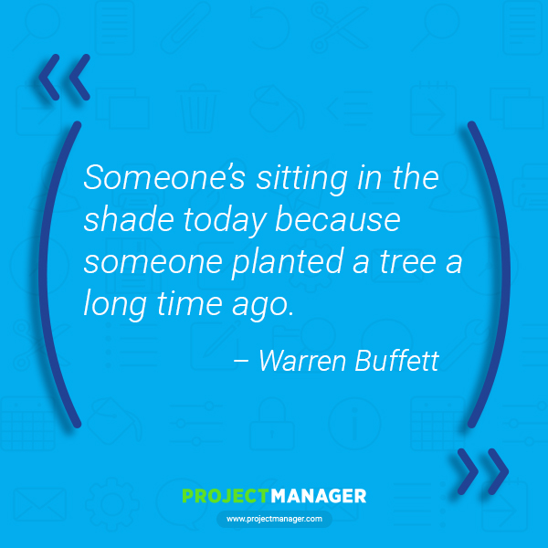
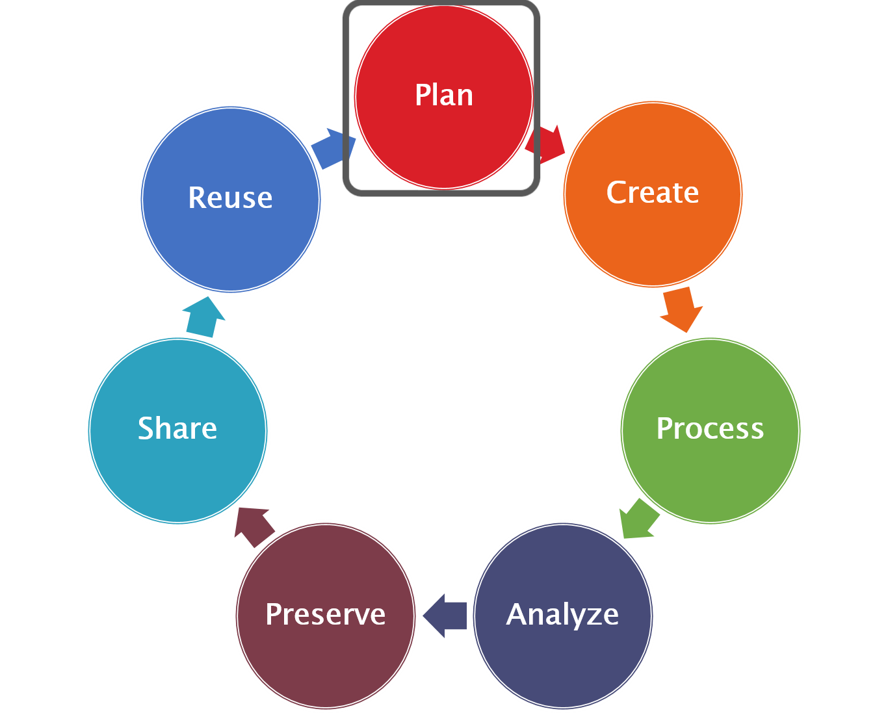

# GEOG 712 Reproducible Research

## Session 5. Data Management Plans (DMP): Tools

### The Research Data Lifecycle Revisited

### Planning at the start of the project will have positive impacts which cascade through the project and help you achieve a better end product with less stress.  

### Portage Data Management Plan Assistant  

As discussed last session, many project or funding proposals require data management to be factored into the research process. Often this requirement will be a formal Data Management Plan (DMP). Even if not required, the process of creating a DMP can help solidify the data acquisition and management processes necessary to generate the data outputs necessary to support reproducible research, funding and journal requirements as well as institutional or project needs. To support researchers in developing DMPs, the Portage Network (now part of the Digital Research Alliance of Canada) provides an online tool that can be used to develop, collaborate/share, and output DMPs (Export to pdf, csv, text, xml, html, json, docx).  The guiding questions help to assess data needs from start to finish.

The following are extracted from the Portage Network Data Management Assistant (guiding questions)

URL:   https://assistant.portagenetwork.ca/  

### DMP Assistant: Data Collection

### What types of data will you collect, create, link to, acquire and/or record?  

### What file formats will your data be collected in? Will these formats allow for data re-use, sharing and long-term access to the data? 

From this, a researcher can take an inventory of the data that they will need to collect or obtain for their project, for example:

Data Description | Production | Acquistion Method |Format_Original| Format_Generic
-|-|-|-|-
Precipitation | Primary | Tipping Bucket |DAT| CSV
Topographic | Secondary | Derive from LiDAR | LAS | CSV 
Vegetation | Secondary| Identify from imagery| HDF | GEOTIFF  
Vegetation (Ground Truth) | Primary | In situ sampling/GPS guided | XLS | CSV

To reiterate the quick hits from last meeting, consider:

### File formats  

* Open formats, non-proprietary where possible
* Lossless formats for imagery
        
### What conventions and procedures will you use to structure, name and version-control your files to help you and others better understand how your data are organized?

Document your folder structure and file naming conventions to assist you in maintaining consistency.  

Develop your conventions with the following in mind:

### Folder Structure

*  What types of files will be associated with your project
*  Think about how you would search for information, (e.g. by location, by experiment, by variable).  Also consider how colleagues may search for data/information.

##### From UK Data Service: https://www.ukdataservice.ac.uk/manage-data/format/organising  

### File Naming  

Identify what elements you want in your file name to assist you and others to find data quickly.

Elements could include:
*  Version
*  Creation Date
*  Data Owner/Creator
*  Content (e.g. Variable, Survey instrument, etc.)
*  Institution or research group
*  Project number
*  Site/Location
    
Names should: 

*  Be brief but meaningful (Create a reference document for decoding)
*  Avoid special characters and spaces (use hyphens, or underscores)
*  Leave the file extension to refer to application-specific file format indicators
*  Indicate version

#### Additional Resources

[File Naming and Folder Structure](https://www.cessda.eu/Training/Training-Resources/Library/Data-Management-Expert-Guide/2.-Organise-Document/File-naming-and-folder-structure)

[ISO 6801](https://www.cl.cam.ac.uk/~mgk25/iso-time.html)

### DMP Assistant: Documentation and Metadata

### What documentation will be needed for the data to be read and interpreted correctly in the future?  

### How will you make sure that documentation is created or captured consistently throughout your project?  

### If you are using a metadata standard and/or tools to document and describe your data, please list here.  

#### Reflections and Best Practices  

Creating a set of policies/procedures will benefit the current project and provide a foundation for future projects as well.  This is another way that we can "reuse" in our research.
Process Documentation

*  Instrument guides
*  Methods descriptions

Standardization
*  Variables
*  Model input/output definitions
*  Coding methods

Readme files

Metadata standards
*  Domain specific
*  Repository specific

### DMP Assistant: Storage and Backup

### What are the anticipated storage requirements for your project, in terms of storage space (in megabytes, gigabytes, terabytes, etc.) and the length of time you will be storing it?  

### How and where will your data be stored and backed up during your research project?  

### How will the research team and other collaborators access, modify, and contribute data throughout the project?  

### McMaster Storage Resources

Table of storage resources from [MREB (McMaster Research Ethics Board) Data Storage](https://reo.mcmaster.ca/download/data-storage-and-security-tools) :

#### The [Research Data Storage Finder tool](https://rdm.mcmaster.ca/finder) provided by the Research Data Management team (Mills Library) helps to identify suitable storage resources depending on your data (*Note: Descriptions and access information are provided for the listed options when checked):

 

#### Reflections and Best Practices
*  3-2-1 Backup strategy
*  Estimate size of files
*  File Organization
*  Process Documentation - identfiy media and frequency of backups
*  Standardization

### DMP Assistant: Preservation  (Project/Supervisor)

### Where will you deposit your data for long-term preservation and access at the end of your research project?
### Indicate how you will ensure your data is preservation ready. Consider preservation-friendly file formats, ensuring file integrity, anonymization and de-identification, inclusion of supporting documentation

#### Reflections and Best Practices

*  Ensure adequate documentation
*  Identify best formats for preservation

#### Where code or proprietary data formats are unavoidable, it is critical to describe software dependencies including:

*  What version of software was used to generate/run code or create data
*  What dependencies (such as required R packages) exist
*  Where to obtain required software
*  Potentially identifying software archives or even archiving software versions yourself
*  Use tools to manage dependencies such as Packrat in R Studio or similar

### DMP Assistant: Sharing and Reuse

### What data will you be sharing and in what form? (e.g. raw, processed, analyzed, final).
### Have you considered what type of end-user license to include with your data?
### What steps will be taken to help the research community know that your data exists?

#### Reflections and Best Practices

* Necessary Documentation
* Document how data will be provided to your supervisor and/or collaborators/coworkers
* Collaboration - share with supervisor - get feedback

### DMP Assistant: Responsibilities and Resources

### Identify who will be responsible for managing this project's data during and after the project and the major data management tasks for which they will be responsible.
### How will responsibilities for managing data activities be handled if substantive changes happen in the personnel overseeing the project's data, including a change of Principal Investigator?
### What resources will you require to implement your data management plan? What do you estimate the overall cost for data management to be?

#### Reflections and Best Practices

*  Process Documentation - Day to day handling of data.  Can someone step in and continue the project?
*  Standardization

### DMP Assistant: Ethics and Legal Compliance

### If your research project includes sensitive data, how will you ensure that it is securely managed and accessible only to approved members of the project?
### If applicable, what strategies will you undertake to address secondary uses of sensitive data?
### How will you manage legal, ethical, and intellectual property issues?

#### Reflections and Best Practices

* Store approved uses and storage requirements with data
* Consider sharing metadata in instances that the data itself cannot be shared
* Consider if partial, anonymized, or aggregated data may be shared if raw data is restricted

### The following provide additional guidance on the development of DMPs

#### Data Management Plan elements described with sample text for each:
From North Carolina State University Library:

[Elements of a Data Management Plan - with examples](https://www.lib.ncsu.edu/data-management/how_to_dmp)

#### Sample Plan

This is an interesting document as it identifies positive and negative examples of answers for the various sections.  
[NSF ENG Data Management Plan Template for the University of Michigan College of Engineering](https://deepblue.lib.umich.edu/bitstream/handle/2027.42/86586/CoE_DMP_template_v1.pdf?sequence=1&isAllowed=y)

### Activity

1. Create documentation for your project data using the requirements for the[ Elsevier Data in Brief submissions](https://www.elsevier.com/journals/data-in-brief/2352-3409/guide-for-authors) as a guide. Note the [Data in Brief at a Glance](https://www.elsevier.com/__data/promis_misc/Data%20in%20Brief%20Article%20at%20a%20Glance%20illustration.pdf) gives a nice overview of what is needed and the template can be used to develop the document. Put your work in your course GitHub repository and notify instructors when ready for review.
    
  
### Suggested readings

[Ten Simple Rules for Creating a Good Data Management Plan (Public Library of Science (PLOS)](https://journals.plos.org/ploscompbiol/article?id=10.1371/journal.pcbi.1004525)

[RDM for Busy People](https://portagenetwork.ca/wp-content/uploads/2019/08/Brief_Guide_RDM_August2019.pdf)

**NOTE**  _dependency management_. 
https://docs.gradle.org/current/userguide/introduction_dependency_management.html
