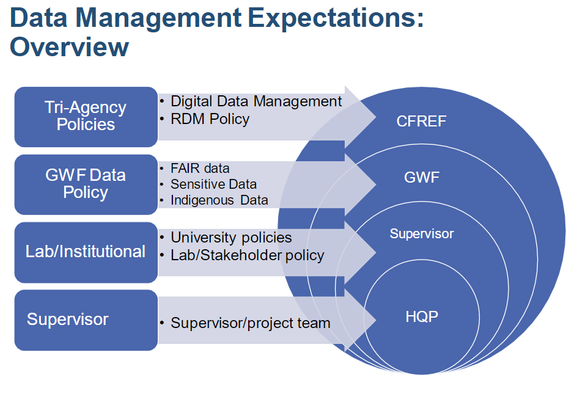
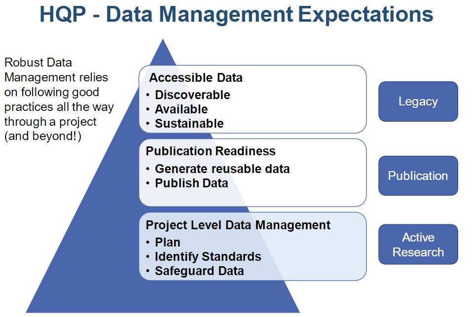
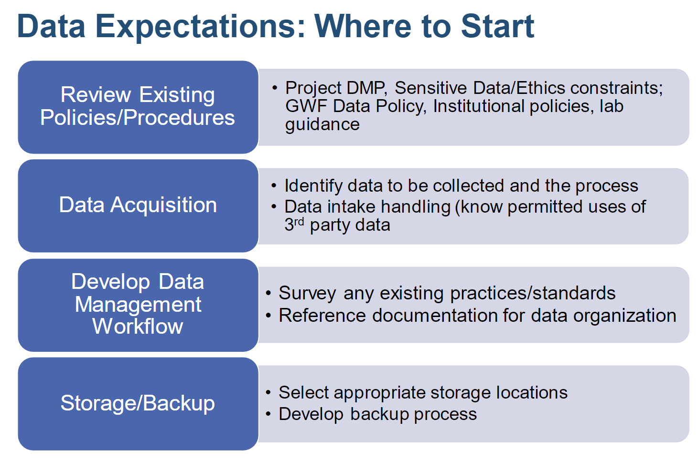
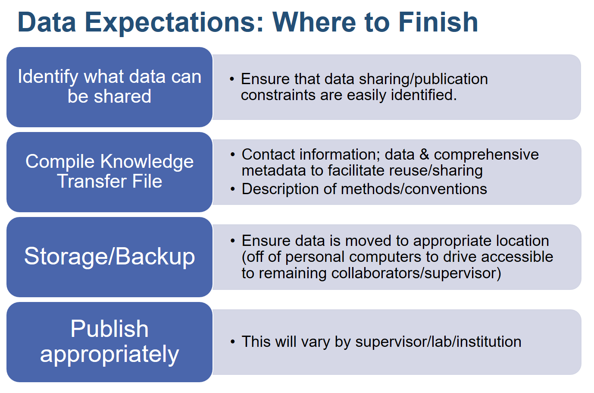
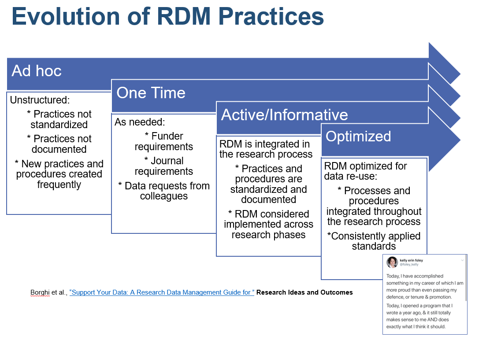

# GEOG 712 Reproducible Research

## Session 6. Data Management Planning and Best Practices review:  Building Blocks for Reproducibility and Reusability

### Data In Brief Activity

Review of Activity from last session: 
- Assignment: 
Create documentation for your project data using the requirements for the[ Elsevier Data in Brief submissions](https://www.elsevier.com/journals/data-in-brief/2352-3409/guide-for-authors) as a guide. Note the [Data in Brief at a Glance](https://www.elsevier.com/__data/promis_misc/Data%20in%20Brief%20Article%20at%20a%20Glance%20illustration.pdf) gives a nice overview of what is needed and the template can be used to develop the document. Put your work in your course GitHub repository and notify instructors when ready for review.  
-  Example from [Data In Brief Example](https://www.sciencedirect.com/science/article/pii/S2352340920310568) publication
-  Challenges 

### Goal of Data Management Practices: Self-Described Datasets
  
The aim of data documentation is straightforward information that provides adequate information to understand the source of the data, the structure of the data and facilitate proper use of the data. 

One way to accomplish this is to ask a colleague or friend to review data documentation. This process can provide an assessment of reusability without the burden of pre-existing knowledge that can fill in omissions.  Asking for a review by someone who is less familiar with the project or field can be very useful in identifying areas that need clarification.

### Goal of Open Data and Science

### Motivation

The requirements for strong data management practices are growing through the funding and publishing mechanisms in academia. The Principal Investigator (PI) is ultimately responsible for dictating the project practices.  

As a Highly Qualified Personnel (HQP), your role in DM is to be attentive to your data throughout the research process. The results of your work may not be to archive datasets but chances are that data deposit will be required to support publications or simply to ensure that your supervisor has complete research data and artifacts when you graduate.

Succession planning – reporting and who needs to know what

-  What measures do we put in place to make sure data does not get lost or orphaned? 
-  What measures do we put in place to make sure that hand-offs are smooth and effective when project is concluded?
-  How to track changes and keep people aware so that all using the data are using the correct copy (Authoritative files and Version control.)
### Who has a stake in the data?

https://secretariat.mcmaster.ca/app/uploads/2019/06/Ownership-of-Student-Work.pdf
 -  property of the student and the research supervisor, either of whom has the right to make them available to other
individuals as well. 
-  Both student and supervisor are responsible for insuring that
proper acknowledgement of the contributions of the student, supervisor, and
other members of the research team is made when the data are released in any
form.
-  When the data are acquired through the student's individual effort, and without
the use of University laboratories or funding, then they are usually the property of
the student making that effort. 
- When the student collects data using research instruments including interview schedules and
questionnaires developed wholly or in part by the research supervisor or by some
other person or agency the right to ownership and/or use of
the data may be shared among the parties involved.
-  Given the range of possible alternatives it is not possible to set absolute guidelines in advance covering all
such situations. Consequently, it is recommended that students and supervisors
make clear agreements in advance concerning the ownership and use of data
collected in this fashion.
-  Ownership of data may also be affected by the terms of
a research contract that has supported the work. 

## Student-Supervisor Agreements

https://students.usask.ca/documents/graduate/student-supervisor-agreement.pdf

-  The Student will keep orderly records of all research data produced or developed.
-  Where research data is produced or developed, both the Student and Supervisor(s) will have
access to the data at all times.
-  Both Student and Supervisor(s) understand that the provisions of the University’s Intellectual
Property Policy pertaining to work done while a graduate student, as well as the guidelines
around publication and access to research data, remain in place even after the Student is no
longer attending the University

https://students.usask.ca/graduate/supervisors.php#Whattodiscuss

-  Can my supervisor use my research, written work, and/or take first authorship on articles or presentations using that research or data if, after some fixed amount of time has passed, I have not used the research or data myself?
-  Who has access to my research or data?
-  Am I expected to publish my research or findings, in addition to writing my thesis?
-  Could you tell me about how you manage collaborative projects in terms of such things as who has access to data?
-  If I take a leave, can my supervisor or other students or members of the department use my data for their research or graduate program?

https://ihpme.utoronto.ca/wp-content/uploads/2015/05/memo-of-understanding-2011.pdf

In addition, the student and supervisor should discuss/define:
-  Ownership and use of data 

https://artsandscience.usask.ca/psychology/documents/student-supervisor-agreement-template.pdf

-  What is the approximate date for completion of lab/field work/collection of data?
-  What is the approximate date for completion of data analysis?

### Data Management is an integral part of the research process
As we take another pass at developing a successful data management strategy it is important to note that when researchers develop a project plan, data is already a key part of the inquiry. The quick hits and reflection that you have completed on the data from your project start to set you up for success. The key to generating data that can be sustainably used is documenting the data development process from beginning to end.  You want your data documentation to be like writing a journal, not like doing a historical review requiring you to dig up artifacts and piece things together.

These data activities that are already being done can be reframed as a Road Map and as items to address in the key areas of RDM.

At the start of research it is critical to think about not only the inputs but also the eventual outputs of research. When we think about our starting point and where we want to end up we can plot a course.

As we identify the key outcomes we can develop the work plan to achieve them.

At a certain point in your research you will be required to or simply choose to share your data - for instanct to support a journal article or collaborate with other researchers.
### Licensing Considerations

- The licensor has expended significant resources gathering, assembling and compiling the data, and that the data is the valuable property of licensor

Data ownership and use.  

-  licensor's ownership of and the licensee's permitted use of the data.
-  specific acknowledgment from the licensee of the source

## Creative Commons

https://creativecommons.org/share-your-work/licensing-types-examples/#by

Creative Commons is a prevalent licensing choice.  Each license has varied restrictions on sharing and use.

There are other licensing types that may be more appropriate to your data or code.

### Third Party Data

The situation becomes somewhat more complex if you are _not_ the author of the data. In the social sciences it is common to work with secondary data, either from Statistics Canada or various other organizations, some of which may have data policies, but other may not.

To use a case: John is doing research on school closures. His research needs data from different sources:

- Standardized test scores, from [EQAO](http://www.eqao.com/en)

- Socio-economic and demographic data from the [Census Program](https://www12.statcan.gc.ca/census-recensement/index-eng.cfm)

- Local data from the [City of Hamilton](http://open.hamilton.ca/)

In addition, he will produce other data, such as accessibility or walkability scores.

EQAO has an agreement that includes, among others, the following conditions:

- The data will be used only for the purposes outlined in the description of the research project.

- Data will not be shared, copied or otherwise made available to additional persons or parties.

- The data shall be destroyed one year after the research project is completed.

EQAO is a crown agency, meaning a state-owned enterprise, and the data are semi-public in the sense that EQAO maintains a [data portal](http://www.eqao.com/en/research#Access) and seems to grant all reasonable requests, as long as any information that could be used to identify individuals is not requested. It seems plausible that anonymized records could be put in the public domain, but maintaining control of the data is the default for most organizations.

Statistics Canada, on the other hand, operates under an [Open License](https://www.statcan.gc.ca/eng/reference/licence) that grants users of information that Statistics Canada has made public, fairly unrestricted rights in its use:

>>Subject to this licence, Statistics Canada grants you a worldwide, royalty-free, non-exclusive licence to:
>>
>> - use, reproduce, publish, freely distribute, or sell the Information;  
>> - use, reproduce, publish, freely distribute, or sell Value-added Products; and,  
>> - sublicence any or all such rights, under terms consistent with this licence.  
>>  
>> In doing any of the above, you shall:
>>  
>> - reproduce the Information accurately;  
>> - not use the Information in a way that suggests that Statistics Canada endorses you or your use of the Information;  
>> - not misrepresent the Information or its source;  
>> - use the Information in a manner that does not breach or infringe any applicable laws;  
>> - not merge or link the Information with any other databases for the purpose of attempting to identify an individual person, business or organization;  
>> - not present the Information in such a manner that gives the appearance that you may have received, or had access to, information held by Statistics Canada about any identifiable individual person, business or organization; and  
>> - not disassemble, decompile or in any way attempt to reverse engineer any software provided as part of the Information.

Notice that although Statistics Canada may modify this license at any time, use of publicly available data products is governed by the license in force _at the date and time that the information was accessed_. Therefore, it is advisable to document the access date and time with any datasets obtained from Statistics Canada.

The license also specifies the following:

>> (a) You shall include and maintain the following notice on all licensed rights of the Information:
>>
>> Source: Statistics Canada, name of product, reference date. Reproduced and distributed on an "as is" basis with the permission of Statistics Canada.
>> 
>> (b) Where any Information is contained within a Value-added Product, you shall include on such Value-added Product the following notice:
>>
>> Adapted from Statistics Canada, name of product, reference date. This does not constitute an endorsement by Statistics Canada of this product.

Other jurisdictions have also adopted variations of open licenses for their data portals, including the [City of Toronto](https://www.toronto.ca/city-government/data-research-maps/open-data/open-data-licence/) and the [City of Hamilton](https://www.hamilton.ca/city-initiatives/strategies-actions/open-data-licence-terms-and-conditions).

### If you are using data that you did not primarily collect, it is a good idea to understand what your rights as a user are, especially if you wish to ensure that research is reproducible.

## Data Management Wrap-up

Data management is critical to accountable, trusted research.  Reproducibility is the ultimate goal but it is an iterative process that will evolve over time.

### Activity

1. Complete the Data In Brief activity - place in ReadMe file to make it accessible by others to review. Enable comments through the Issues tools. So, 

Create documentation for your project data using the requirements for the[ Elsevier Data in Brief submissions](https://www.elsevier.com/journals/data-in-brief/2352-3409/guide-for-authors) as a guide. Note the [Data in Brief at a Glance](https://www.elsevier.com/__data/promis_misc/Data%20in%20Brief%20Article%20at%20a%20Glance%20illustration.pdf) gives a nice overview of what is needed and the template can be used to develop the document. Put your work in your course GitHub repository and notify instructors when ready for review.  
-  Example from [Data In Brief Example](https://www.sciencedirect.com/science/article/pii/S2352340920310568) publication
  
### Suggested readings

[Digital Curation Centre - How to License Research Data](http://www.dcc.ac.uk/resources/how-guides/license-research-data)

[Repository Selection](https://www.nature.com/sdata/policies/repositories)

https://help.data.world/hc/en-us/articles/115006114287-Common-license-types-for-datasets

https://legal.thomsonreuters.com/en/insights/articles/data-licensing-taking-into-account-data-ownership

* Add Issues/Bug enabling
* Define use_read_me_rmd instructions
* Note on wayback machine - 
* Importance of noting date of download

