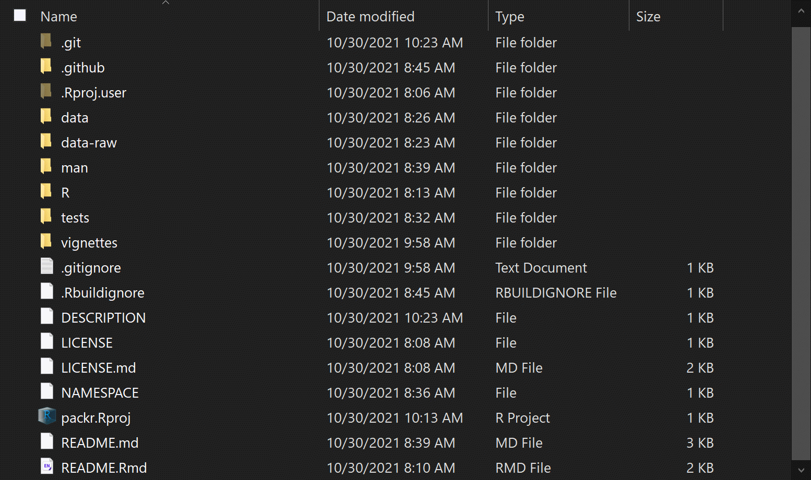
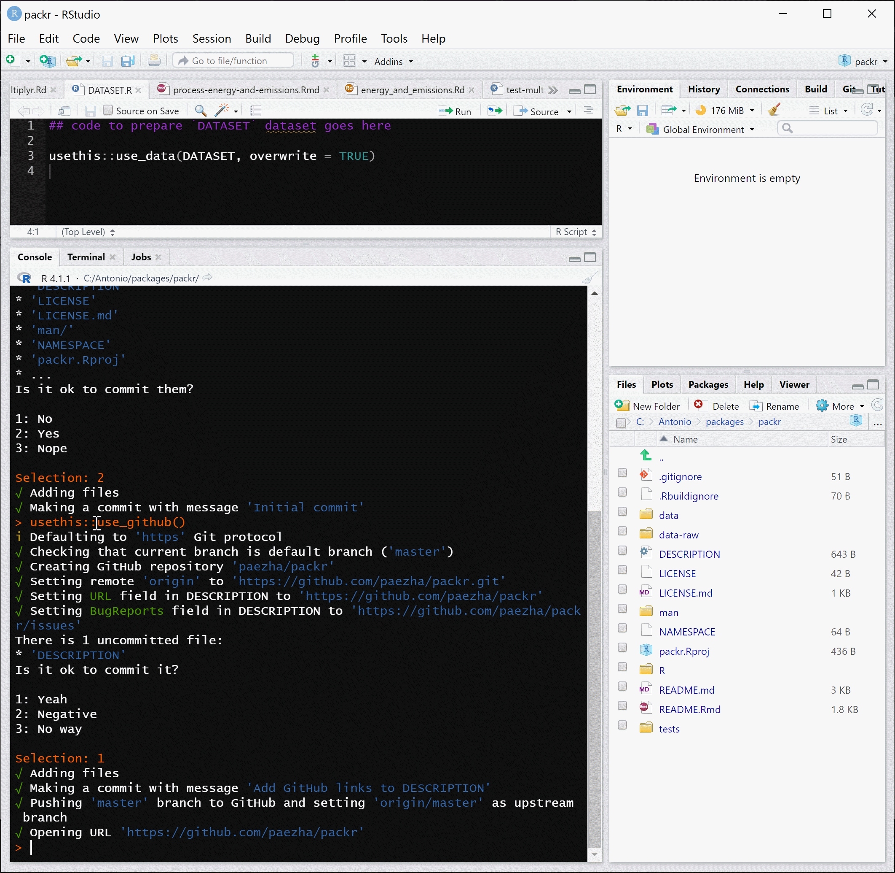
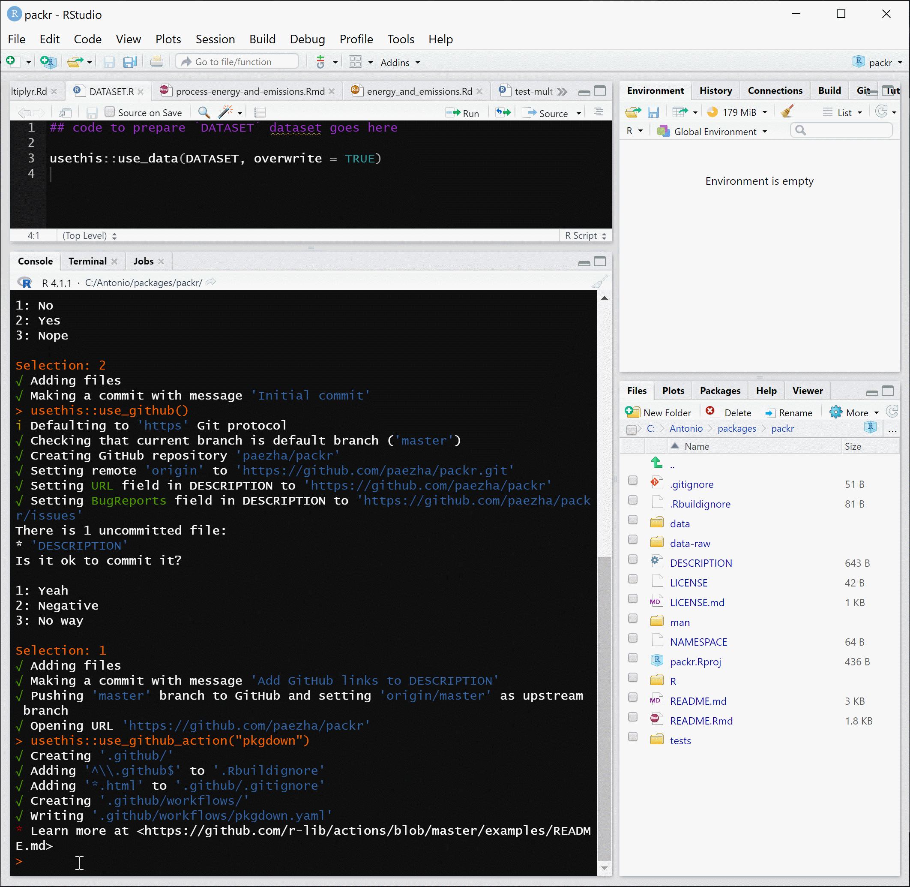
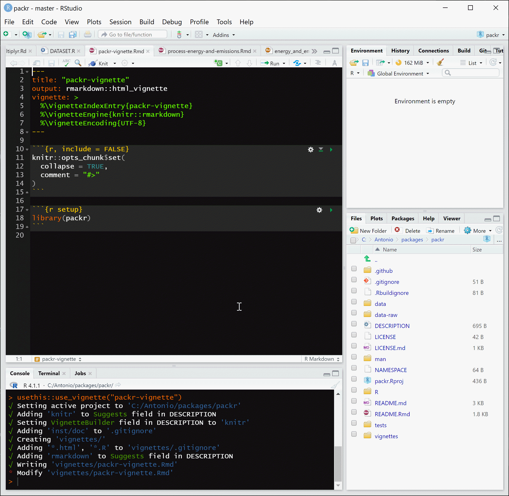

<!-- README.md is generated from README.Rmd. Please edit that file -->

```{r, include = FALSE}
knitr::opts_chunk$set(
  collapse = TRUE,
  comment = "#>"
)
```

# GEOG 712 Reproducible Research

## Session 7. Creating packages in R and documenting datasets

In the preceding sessions we learned about Data Management Plans. There are several key aspects of these plans, including how to document data and data preparation processes. An important aspects of planning for the long term life of the data is also how to transfer it, either to a supervisor, colleagues, students, or other interested parties.

In this session we will learn about packages in `R`. Although by no means the only way to document and share data (and processes), packages offer a convenient way of bundling up code, data, documentation, and examples in a conveniently shareable and usable unit.

Creating packages can become quite a sophisticated matter, depending on what their objective is. Here, we will work on a small example, and at the end you will find suggested readings that you can follow to deepen your understanding of the art and the technique of package creation.

### Packages

According to [Wickham](http://r-pkgs.had.co.nz/), packages in `R` are "the fundamental units of reproducible code". 

Packaging code in this way has been no doubt one of the reasons why the `R` ecosystem became and has remained hugely popular; another reason being a relatively simple and effective way of finding, installing, and managing packages. Many `R` packages increase the functionality of `R`, but a package can serve other functions and distribution is not necessarily the only reason to create a package. Packaging code and data forces you to go through the process of organizing all your materials, documenting them, and possibly creating examples. This might come handy when, in the future, you need to revisit a project. It can help you to explain what you have done. And it can enhance reproducibility of research, if a package is a companion to a paper you write.

We will use an example as we cover the basic steps of creating a package. To see what the outcome of that might look like, run the following code, which will install the package used in this session directly from GitHub:
``` r
if(!require(remotes)){
    install.packages("remotes")
    library(remotes)
}
remotes::install_github("paezha/packr", 
                         build_vignettes = TRUE)
```

If you succeeded in installing the package, you can proceed to load it now:
``` r
library(packr)
```

Try the following:
``` r
?packr
```

And also this to examine all datasets available by package, including data packed with `packr`:
``` r
data(package = "packr")
```

To see the documentation for the data:
``` r
?energy_and_emissions
```

### What goes in a package?

An R package consists of, at a minimum, one function or one dataset, and depending on how the package is created, one or more files that support the package.

Over time, a standardized folder structure has been refined to ensure that package creation and distribution is as seamless as possible. This is how a package folder might look like once that it has been developed:



Notice the following _essential_ components:

- A folder `R/`: this is where code goes.
- A folder `man/`: this is where documentation goes.

A package must include these two. In addition, it can include:

- A folder `data/`: this is where data sets in format `.RData` or `.rda` go. Raw data (for instance, Excel files, `.csv` files, `.shp` files, etc.) are stored elsewhere depending on whether they will be shared with the package or not.
- A folder `data-raw/` to store raw data that are processed to produce `.RData` or `.rda` files.
- A folder `tests/` where files for testing functions live.
- A folder `vignettes/`: this is where more extended examples of use of the package go.

There are a few additional folders, a `git/` folder for files associated with the versioning system git; a folder `github/` to store files needed to work with the online service GitHub; and an `Rproj.user/` folder that is created when the `R` project associated with the package is created in R Studio.

Now, lets look at some of the files there:

- `.RBuildignore`: this is a text file that tells `R` to ignore files or folders when building the package. For instance, the `.Rbuildignore` file in this particular package contains the following lines:
```
^packr\.Rproj$
^\.Rproj\.user$
^LICENSE\.md$
^README\.Rmd$
^data-raw$
^\.github$
```

None of these files or folders will be part of the built package. There are some rules to write the names of things to exclude in the `.Rbuildignore` file. If I write only `raw`, it will exclude _everything_ that contains the characters "raw". For instance, if I had a script named `withdraw.R`, it would be excluded. So we need to define more clearly what it is that we wish to exclude. The character `^` is used to indicate the beginning of an expression and the character `$` indicates the end of an expression. By writting `^raw$` I ensure that only things that are named _exactly_ `raw` are excluded. The easiest way to edit the `.Rbuildignore` file is by using the package {usethis}:
``` r
use_build_ignore()
```
- `.gitignore`: this is a text file that tells git to ignore files or folders when keeping versions of the project. This is used to keep files or folders private and not shared in the repository beyond your local version of the project. The easiest way to edit the `.gitignore` file is by using the package {usethis}:
``` r
use_git_ignore()
```
- `DESCRIPTION`: A text file that describes the package in a standard way.
- `LICENSE`/`LICENSE.md`: Files with the license information for the package.
- `NAMESPACE`: A text file with space for _names_ that map the value of objects to their names. Sounds confusing? It is because it is one of the most confusing aspects of creating a package, but fortunately not critical if you are developing packages for yourself or for limited circulation. If you wish to submit your package(s) to the central repository CRAN, then this becomes more important, because `NAMESPACE` helps to avoid conflicts between packages, among other things. See more about `NAMESPACE` [here](http://r-pkgs.had.co.nz/namespace.html). 
- `packr.RProj`: R Studio project file.
- `README.Rmd`/`README.md`: Readme files for the GitHub repository.

This should give you a broad panoramic of what goes into a package. Lets now review these elements in turn by means of an example.

### Initializing a package

Package creation (and maintenance) in R Studio is linked to the use of _Projects_. Creating a project in R Studio creates a file and an invisible folder to store auto-saves and other items. The advantage of working in projects is that work can be compartmentalized: the project will _remember_ where its files are, what options are used, and so on.

Before you create a package you need to think of a name for it. Package names can only include letters, numbers, and periods (no other special symbols), and the use of periods is not advised because they can create confusion with file extensions. For this example, I have called my minimal package example `packr` (a quick Google search suggests that this name is not the name of an existing `R` package!). When you choose your own package name, keep in mind Wickham's [naming advice](http://r-pkgs.had.co.nz/package.html#naming).

The package {usethis} has numerous functions that assist in the creation of packages. For this example, we will begin by initializing a package with the following function that specifies _where_ to create the package, and the name of the package:
``` r
usethis::create_package("C:/Antonio/packages/packr")
```

The function `create_package()` will check if the name you have chosen is a valid name for CRAN, and if the name is valid, it will initialize a project in the directory indicated:


Immediately, a new R Studio session is launched, and you will find yourself in the project folder where you will see that the required folders and files have been created: 


What are these items? Let us take a look at some of the key components of the package.

### `DESCRIPTION`

A `DESCRIPTION` file was initialized with the package. This is a text file that includes some basic information about the package. After editing this file with specific information it contains a minimal description of the package. There will be an opportunity to describe the package more fully elsewhere, and for the time being, this is my `DESCRIPTION`:


### `R/`

This folder is currently empty, but here will go all `R` code that you wish to include in the package. 


### `LICENSE`

A license is initialized when the package is created, and it can be customized by using one of the following functions from the {usethis} package:
```
usethis::use_mit_license("Antonio Paez")
usethis::use_ccby_license()
```

### Add `README`

It is useful to have a README file, and you can add one with the following function:
``` r
usethis::use_readme_rmd()
```

This will create an Rmarkdown file called `README.Rmd` that will become the `README.md` document used, for example, in a GitHub repository. An advantage of working with `README.Rmd` is that it allows you to include code, equations, figures, etc. This is how I create the `README` files for the package `packr`: 


Notice that this is only a template and needs to be edited with information relevant to the package. This [file](https://github.com/paezha/Reproducible-Research-Workflow/blob/Session-07/Session-07-Creating-R-Packages-and-Documenting-Data/packr-README.Rmd) includes the information in the `README.Rmd` file, and it looks like this:


The header was edited to include the argument `pandoc_args: --webtex` used to display equations. The rest of the file describes the package and how to get started with it.

### Create an `R` script to document the package

The next item that we need is folders/files for documentation. We initialize this as follows:
``` r
usethis::use_package_doc()
```
This creates an `R` script in the `R/` folder with the name of the package. This file will open in the editor in R Studio:


Again, this file is just a template, so we need to edit it with information relevant to the package. We add the following text after the pre-scripted blocks (beginning on line 10):
```
#' packr: A package with a minimum example of package creation.
#'
#' This package is an exercise in package creation using
#' R studio. The package includes a sample function and
#' a sample dataset with their respective documentation.
#'
#' @docType package
#' @name packr-package
#' @author Antonio Paez, School of Earth, Environment and Society, McMaster University \email{paezha@@mcmaster.ca}
#' @references \url{https://github.com/paezha/packr}
NULL
```
The file now looks like this:

You can customize the comments in your package now. The symbol `@` is used for tags. In the example, there are four types of tags in use: 

1. `@docType`: the type of document (package) 

2. `@name`: the name of the document (`packr-package`).

3. `@author`: the name of the author of the package, followed possibly by other information such as affiliation and email (use double `@@` in email addresses; this is to distinguish the "at" mark from a tag mark).

4. References (possibly with links).

At the end, _uncommented_ we write `NULL`.

There are many other tags that can be used to describe different aspects of a package, function, or data set, and if you begin a comment in the script with `@` suggestions for tag will pop up for you. To learn more about tags in documentation, check [this](https://roxygen2.r-lib.org/articles/rd.html).

### Adding stuff to the package

The steps above set up the package and now we are ready to begin packing it with useful stuff. 

### Creating a simple function

First we will create a new function to add to the package. To do this, use the following function (from the {usethis} package) to create a new `R` script. The name of the function will be `multiplyr`:
``` r
usethis::use_r(name = "multiplyr")
```

A file is placed in the `R/` folder and opened in the editor:


In that script you can copy this example of a simple function, or feel free to create another function if you wish:

```
# Write function then document
#' Multiply two numbers
#'
#' @param a A number
#' @param b A number
#' @return The product of \code{a} and \code{b}
#' @export
#' @examples
#' multiplyr(2, 5)
#' multiplyr(4, 8)
multiplyr <- function(a, b){
  a * b
}

```

Notice that a function includes a name (`multiplyr`) and an assignment (`<-`) followed by `function()` with the arguments of the function (`a` and `b`). Then, between curly brackets (`{}`) all the operations that comprise the function (in this case simply `a * b`). 

The basic function does something simple, and someone examining it can easily see what is going on. But more complex functions may not be as simple to read. Therefore, it is good practice to document the function. We do this by adding comments to the script. The comments begin with “#'” to indicate that they are _documentation_, and not regular comments. In this example function, the comments are:
```
#' Multiply two numbers
#'
#' @param a A number
#' @param b A number
#' @return The product of \code{a} and \code{b}
#' @export
#' @examples
#' multiply(2, 5)
#' multiply(4, 8)
```

We use more tags here: to identify the parameters of the function, to describe the output (`@return`), and to include examples (`@examples`). We also include a tag `@export`. This tag makes the function usable outside of the package, The default behavior of {roxygen2} is to keep files internal (i.e., it does not export them), so anything from the package that we wish to make publicly available must be explicitly tagged as an `@export`. Exported files are recognized as such in the [NAMEFILE](https://cran.r-project.org/web/packages/roxygen2/vignettes/namespace.html).

Our file with the function now should look like this:


To learn more about functions check the resources [here](https://r4ds.had.co.nz/functions.html), and [here](https://nicercode.github.io/guides/functions/), and for some more advanced treatment [here](http://adv-r.had.co.nz/Functions.html).

### Generating documentation in the `man/` folder

The name of the `man/` folder  is short for “manual”. In this directory go the help files for the functions stored in `R/`. Documentation is written in a syntax loosely based on LaTeX, and documentation files are rendered in different formats for ease of reading, including pdf, HTML, and plain text.

Writing documentation used to be one of the most tedious aspects of creating a package. Instead of writing these files by hand, a package called `roxygen2` as developed to facilitate the creation of documentation. This package has several advantages over writing documentation manually:

- Code and documentation are linked, and if you change your `R` script files, you will be reminded to update your documentation files.  
- The package creates a documentation template to work with, which saves time.  
- It automates some aspects of documentation which makes the learning curve gentler.  

When using `roxygen2` you write the documentation directly in the script that contains your function, and this is translated into the syntax of and `R` documentation file, with the extension `.Rd`. As noted above, {roxygen} comments begin with `#'` to distinguish them from regular `R` comments, which begin with `#`. Notice the apostrophe!  

To create `roxygen2` documentation, we use `devtools::document()`, which calls `roxygen2::roxygenize()` to do the hard work:
``` r
devtools::document()
```

If you try this, you will see that a few things happen: the `man/` folder is created, the `NAMESPACE` file is written, and the `Rd` files are written or rewritten (if they already existed but their corresponding scripts were updated). Navigate to the `man/` folder, and you will see that there are new documentation files: for the package and for the function we created. Also, notice the warning to NOT edit this file manually – it is linked to the source script, which 1) saves you from having to work twice; and 2) ensures that you do not lose track of documentation files:


It is important to remember that any time that you add a function (or a data set that needs documentation; see next) the documentation needs to be updated by running `devtools::document()`.

### Adding data files to the package 

Often we wish to include data with our package, either to use in examples or because the objective of the package is to share data. Data that already exists in one of the native formats (e.g., `.RData` or `.rda`) used by `R` goes directly in the `data/` folder. In many other cases, we may have data that needs to be converted into one of those native formats. These data can be placed in a dedicated folder, called `data-raw`, which will not be included in the package. To add this folder to the project, we can use the following {usethis} function:
``` r
usethis::use_data_raw()
```

This function will create the folder, and will initialize a script to process raw data, which at the moment only has one line of code:


You can write the code needed to preprocess the data in this script, which must end with the line of code currently there:

``` r
usethis::use_data(DATASET, overwrite = TRUE)
```

Replace DATASET with the name of one, _and only one_, data object in the Environment. This object will be saved in the `data/` folder with the same name. There is a one-to-one correspondence between the name of the object and the file where it is saved, which helps to ensure that the contents are evident from the name of the file, and to avoid confusion.

In my case, I prefer to write my pre-processing code in an Rmarkdown file, so that I can also write extensively about the steps taken to generate the data object. For this example, I use the file found [here](https://github.com/paezha/Reproducible-Research-Workflow/blob/Session-07/Session-07-Creating-R-Packages-and-Documenting-Data/process-energy-and-emissions.Rmd). This file looks like this:


The script ends with the function to save the data to their corresponding folder:


Of course, I also need to copy all raw data to the folder! The example in this package is an Excel file called `Energy and Emissions.xlxs`, found [here](https://github.com/paezha/Reproducible-Research-Workflow/blob/Session-07/Session-07-Creating-R-Packages-and-Documenting-Data/Energy and Emissions.xlsx).

Once we have the raw data and code to process them, we run/knit all data processing scripts/notebook(s), which will place the output files in `data/`:


### Writing documentation for data objects

Unlike functions that are documented in their own script, data files do not have a script. This is similar to the package itself, that is documented in a specially created script for the comments. We will use the same script to document any and all data files that are included with the package.

The most convenient way of documenting a data file is using `roxygen2`. Using the same format, the structure of the documentation text is as follows:

1. A title for the data set (e.g., `Energy and emissions data for world countries`)

2. A general description of the data set, possibly in several lines or paragraphs even.

3. A tag for the `@format`: the format could be a dataframe, or it could be a raster image, or a matrix, or any of a large number of objects supported by `R`.

4. Possibly a list to `\describe` the data set, within curly brackets. Each item is also tagged as an `\item`, followed by the name of the item in curly brackets, and a description of the item also in curly brackets. For example:

```
\item{bblpd}{Estimated energy consumption in barrels of oil per day}
```

When writing these items we can ask ourselves what information is important to understand the contents of the data set? Units, for instance. Date collected. Instruments used. Be exhaustive to reduce the risk that the data set becomes unusable due to poor documentation. I have seen many examples of data sets that do not indicate the units used to measure stuff!

5. Other tags to characterize the data set. Some of them are

    - `@docType`: the type of document, in this case `data`
    
    - `@keywords`: datasets
    
    - `@name`: name of the dataset
    
    - `@usage`: how to use the dataset; typically this is `data(@name)`
    
    - `@reference`: the name of the paper where the data were published 
    
    - `@source`: the sources of information. For example, if using data from Statistics Canada, this is a good place to acknowledge it as a source  
    
    - `@examples`: examples of use
    
6. The name of the data set in quotation marks at the very end, _not commented_.

The documentation for the data set in the example looks like this:
```
#' Energy and emissions data for world countries.
#'
#' A dataset containing information about 188 world countries, including
#' population estimates, GDP per capita, energy consumption estimates,
#' and CO_2 emissions.
#'
#' @format A data frame with 188 rows and 11 variables:
#' \describe{
#'   \item{Country}{Names of countries as factor}
#'   \item{Area}{Surface land area of country in sq.km}
#'   \item{Population}{Population estimates}
#'   \item{PYear}{Year of the population estimate}
#'   \item{GDPPC}{Nominal GDP per capita in US dollars}
#'   \item{bblpd}{Estimated energy consumption in barrels of oil per day}
#'   \item{EYear}{Year of the energy consumption estimate}
#'   \item{CO2_1995}{CO_2 emissions in kilotonnes per year - 1995 estimates}
#'   \item{CO2_2005}{CO_2 emissions in kilotonnes per year - 2005 estimates}
#'   \item{CO2_2015}{CO_2 emissions in kilotonnes per year - 2015 estimates}
#'   \item{Continent}{Names of continents as factor}
#' }
#'
#' @docType data
#' @keywords datasets
#' @name energy_and_emissions
#' @usage data(energy_and_emissions)
#' @source Energy Consumption Data Source: CIA Factbook, Refined Oil Products Consumption (https://www.cia.gov/library/publications/the-world-factbook/rankorder/2246rank.html) Accessed: September 5, 2017
#' @source CO2 Emissions Data Source: EC Emissions Database for Global Atmospheric Research (http://edgar.jrc.ec.europa.eu/overview.php?v=CO2ts1990-2015) Accessed: September 5, 2017
#' @source GDP Data Source: Wikipedia (https://en.wikipedia.org/wiki/List_of_countries_by_GDP_(nominal)_per_capita) Accessed: September 5, 2017
#' @source Continent names were extracted from package \code{countrycode} (https://CRAN.R-project.org/package=countrycode)
#' @examples
#'  data(energy_and_emissions)
#'  GDPPC <- energy_and_emissions$GDPPC
"energy_and_emissions"
```

The script should now look like this:


After commenting the data in the script, we update the documentation with `devtools::document()`, which will generate a new `.Rd` file with the name of the data object in the `man/` folder:


### Writing tests

To reduce the risk of bugs, you can write tests to ensure that functions do what they are supposed to do. In this example, we first generate a test file with the following function:
``` r
usethis::use_test(name = "multiplyr")
```

This will create a folder called `tests/` and will open a test file for the function indicated by the argument `name =`. This is the test file:


The test file uses the function `test_that()` and can be used to ensure that the output of a function is identical to some known output based on the inputs. Here, we edit the file as follows:
```
test_that("multiplyr-works", {
  expect_equal(multiplyr(3, 2), 6)
  })
```

This is the updated test file:


With this, we have all the components of a minimal package! Our package now includes at least one function, one data set, documentation, and tests. It is now time to check that the package is correctly put together.

### Checking, building, and installing the package

The following function is used to check a package before it is built:
``` r
devtools::check()
```
The function runs a battery of diagnostics to make sure that the package can be built and that it works. This includes, for example, checking the code, and testing functions. When run, `check()` will display progress on the checks and diagnostics:


If the checks are successful, there will be a note saying that there are zero errors, warnings, and notes:


Pay attention to the output, since it will be informative in case errors, warnings, or other notes are issued.

Once we are satisfied with the checks, we can proceed to build the package. For this we use the following function:
``` r
devtools::build()
```

This will generate a compressed file that can be used for distribution. The package is now built and is ready for installation:
``` r
devtools::install()
```

Running this function will produce messages to indicate the status of the installation:


After this, the package will be part of your library! You can now use it. To load the package from your library, you use:
``` r
library(packr)
```
We can check the documentation of the package:
```
?`packr-package`
```
This should display the description of the package. Also try: 
```
?multiplyr
```
This should display the help file for the function. Check also the help file of the data set:
```
?energy_and_emissions
```

### Editing and building a README file

Previously we created a `README.Rmd` file. This file has some basic information about the package. We need to _build_ the README from this file. We do this by running the following code:
``` r
devtools::build_readme()
```

### Using git for versioning your package and GitHub for sharing

It is a good idea to use git to maintain your package. This way, updates of the package are versioned. We set up git functionality with the following function:
``` r
usethis::use_git()
```

This will activate the project and ask you whether you wish commit the files currently there:


In some cases, you might want to create a package for your own personal use and you might be satisfied with keeping just a local version of your project. But if you wish to keep a cloud repository using GitHub, either as a personal back-up or for sharing with the world, you need to set up the project for this:
``` r
usethis::use_github()
```

This will create the repository for you and will ask you whether you want to commit any uncommitted files before pushing the project:



Finally, you can set up a GitHub action from the package {pkgdown} to automate the process of checking and building the package. This way you do not need to do it manually, but instead it is done automatically any time you push changes to the repository. The function to do this is:
``` r
usethis::use_github_action("pkgdown")
```

You will notice that there are some additions to the folder structure:



### How to keep some contents private?

Sometimes there will be things that are not part of the package, but that are part of the work process: this could be anything from notes, raw data, or experimental files. Packages have a way of handling situations like this by means of the `.Rbuildignore` file mentioned before. This file tells `R` which items to ignore when building the package. These items will not travel with the package. This is useful to keep items that are not necessary for the package, or are not for sharing as part of the package (they may still be part of the repository, though).

Create a folder in the directory where your package files are where you wish to keep stuff that will not be part of the package. To declare a private folder, use `usethis::use_build_ignore` with the name of the folder or files that you want to add to the list of items that are ignored:
```
usethis::use_build_ignore("raw")
```

An important note is in order here.

Items declared in the `.Rbuildignore` file are ignored when building the package, but may be otherwise discoverable if you are keeping a repository in GitHub. If you wish to keep the folder with your data private, you will need to declare it in the `.gitignore` file too. For example, if you wanted to keep your raw data from being sent to the cloud, you would use the following function:
``` r
usethis::use_git_ignore("data-raw")
```

Make sure you do this before setting up git and GitHub for your project!

### A little help: vignettes

Help files are short documents that describe the key elements of a function or a data set. But it is possible to create more expansive examples to show potential users how to use your package, more like a user's manual than an entry in a dictionary. Vignettes are writen in markdown and are rendered in various formats for output.

A vignette is initialized using `usethis::use_vignette(name, title = name)`. For example:
``` r
usethis::use_vignette("packr-vignette")
```
The above will create a folder `vignettes/`, will initialize a vignette, and will create all necessary dependencies for the vignette (by updating the `DESCRIPTION` file). The template for the vignette is an `.Rmd` file:



You can then proceed to edit your vignette file ( (the example is available [here](https://github.com/paezha/Reproducible-Research-Workflow/blob/Session-07/Session-07-Creating-R-Packages-and-Documenting-Data/packr-vignette.Rmd)).

IMPORTANT! Any packages used in the vignette need to be declared by the package; do this to use CRAN packages:
``` r
usethis::use_package("package-name")
```
This is how the vignette can be called by a user of the package:
``` r
browseVignettes("packr")
```

Any time that we complete an update of the project we must remember to commit the changes before pushing them to the repository. Since we set up GitHub actions for the package, the package will be checked and built when the updates are pushed.

### Activity

1. Create an `R` project for a new package that you will post to a GitHub repository.

2. Create at least one function, or more if you wish.

3. Prepare at least one sample data set for sharing with the package (more if you wish).

4. Document the package, the function(s), and the data set(s).

5. Check, build, and install the package.

6. Commit and push the package to GitHub.

A script with the steps for creating a package from a scratch is available [here](https://github.com/paezha/Reproducible-Research-Workflow/blob/Session-07/Session-07-Creating-R-Packages-and-Documenting-Data/procedure-to-create-package.R)

### Suggested readings

Parker, H. (2014) [Writing an R package from scratch](https://hilaryparker.com/2014/04/29/writing-an-r-package-from-scratch/)  

Broman, K. (n.d.) [R package primer: a minimal tutorial](https://kbroman.org/pkg_primer/)  
  
Wickham, H. (2015) [R packages: organize, test, document, and share your code](http://r-pkgs.had.co.nz/). O'Reilly Media.  
  
Khanal, A., and Khanal, S. (2018) [Building R packages](https://rstats-pkgs.readthedocs.io/en/latest/index.html#)
