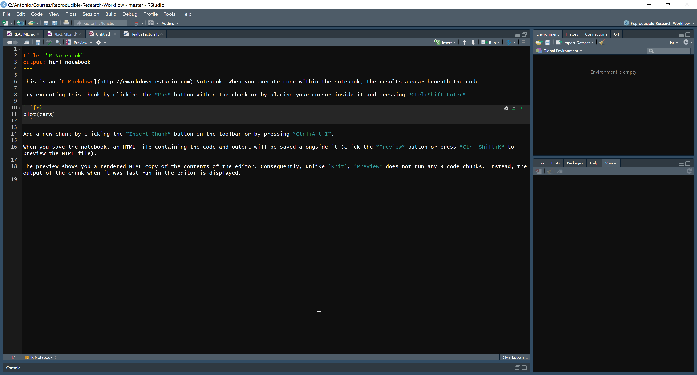
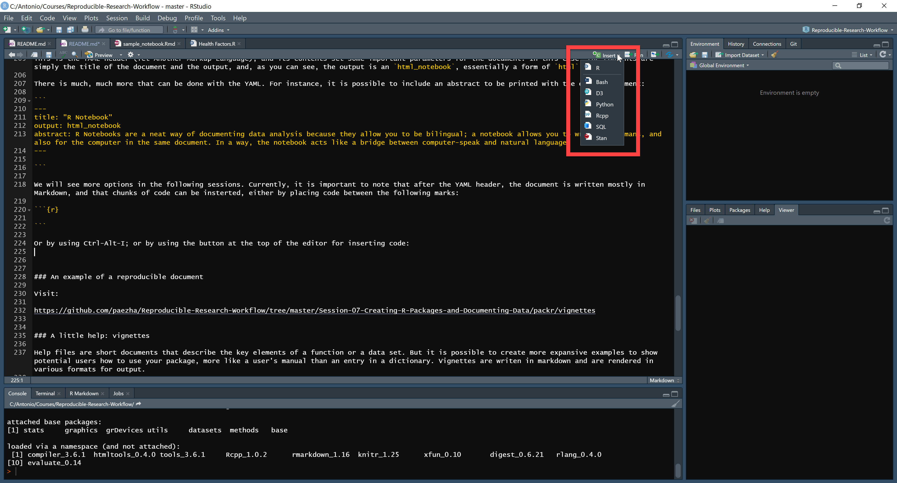
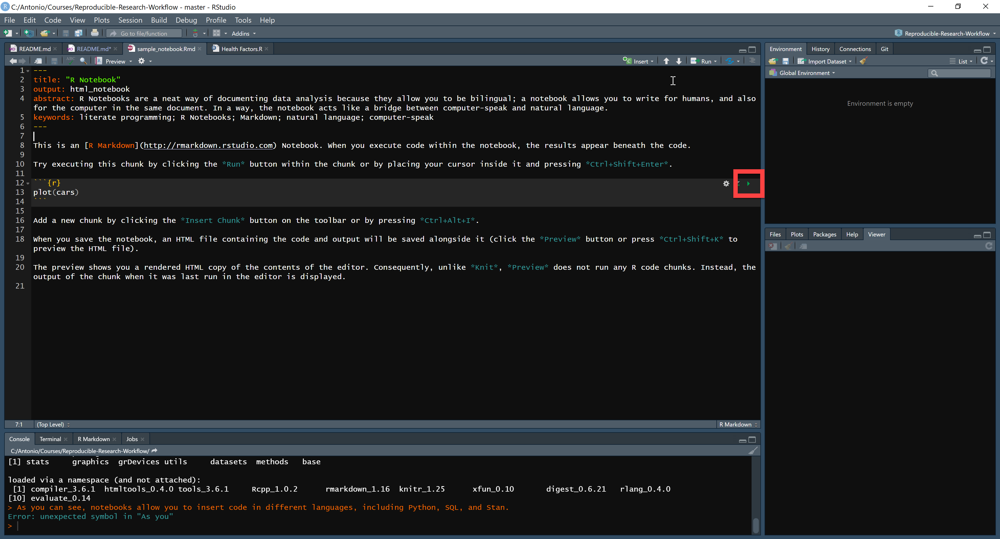
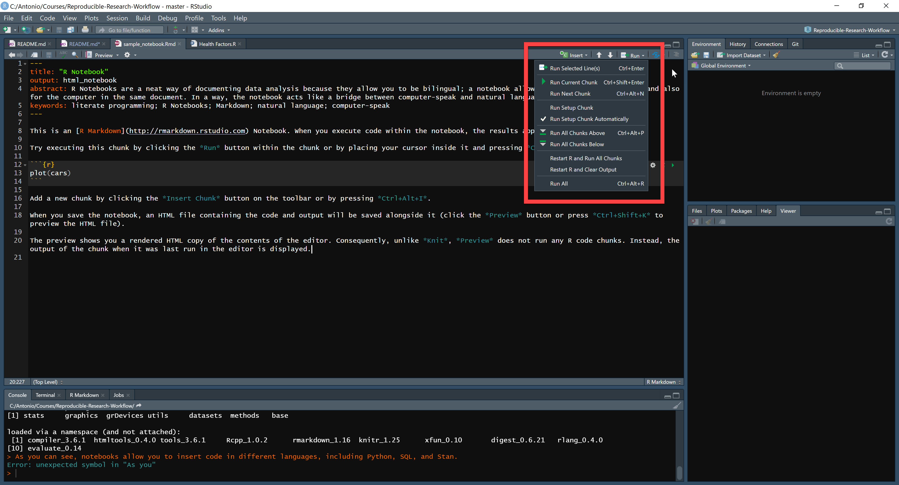
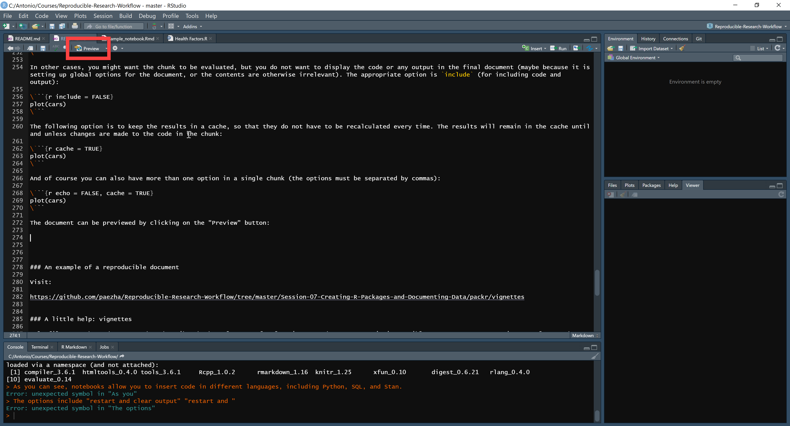

# GEOG 712 Reproducible Research

## Session 8. Documenting data analysis using R Markdown

We have up to this point covered a number of topics relevant for developing a reproducible research workflow, including some important tools (R, Markdown, GitHub), data management plans (DMPs), and how to document and package data to facilitate future use and sharing.

In this session we will discuss the documentation of data analysis. As with other aspects of data reproducibility, there are multiple ways of documenting the process of data analysis. We will focus on one particular tool for this, R Markdown.

Lets begin by quickly reviewing some of the factors that lead to failure of reproducibility.

### Why does reproducibility fail?

Reviews by various authors (e.g., [Ball and Medeiros, 2012](https://www.tandfonline.com/doi/full/10.1080/00220485.2012.659647); [Stodden et al., 2018](https://www.pnas.org/content/115/11/2584.short)) have found that reproducibility often fails for reasons that include the following:

- Incorrect or imprecise citations of data sources
- Failures to define variables, including units and precision
- Data not archived or location not provided
- Run parameters not provided (for instance, random seeds)
- Failures to describe variable transformations
- Missing references to algorithms and/or software used
- Code not available
- Details of methods of analysis used are missing
- Avenues of exploration not documented, including information about negative findings
- Details of computational environment missing, including software versions, hardware specifications, etc.

Some of these points relate to data documentation, archiving, and transferability. Other points relate to documentation of the analysis. 

### Documenting your analysis: what works?

https://www.menti.com/sqjoiu33n7

Karl Broman has some succint [advice](https://kbroman.org/Tools4RR/assets/lectures/06_org_eda_withnotes.pdf) in terms of what to document:

- what were you trying to do?
- what were you thinking about?
- what did you observe?
- what did you conclude, and why?

Documenting these things helps you to avoid grief later, including having to ask yourself:

- ”How did I create this plot?”
- ”Why did I decide to omit those six samples?”
- ”Where (on the web) did I find these data?” 
- ”What was that interesting (variable)?”

If you find you asking these questions yourself, it is a sign that the analysis was not propoerly documented. Likely, since you are asking, you have no good answers, which means your previous efforts have been partially or totally wasted - to the point of having to recreate things from a scratch.

These guidelines are great for thinking about how to document your analysis. Now the question is, how to do it.

### How to document you analysis

#### How it is conventionally done

The most common form of documenting data analysis is by means of scripts. Here is an example taken from a project.

***
#### Documentation: Example 1

```
library(readxl)
library(tidyverse)

df <- read_excel("Capabilities Survey.xlsx")
head(df)

# Set as factor
f0P_MODO1 <- as.factor(df$r0P_MODO1)
levels(f0P_MODO1)[levels(f0P_MODO1)=="A"] <- "PRIVATE" #AUTO
levels(f0P_MODO1)[levels(f0P_MODO1)=="B"] <- "PRIVATE" #TAXI
levels(f0P_MODO1)[levels(f0P_MODO1)=="C"] <- "PRIVATE" #COLECTIVO
levels(f0P_MODO1)[levels(f0P_MODO1)=="D"] <- "PRIVATE" #MOTO
levels(f0P_MODO1)[levels(f0P_MODO1)=="E"] <- "PUBLIC" #METRO
levels(f0P_MODO1)[levels(f0P_MODO1)=="F"] <- "PUBLIC" #BUS
levels(f0P_MODO1)[levels(f0P_MODO1)=="G"] <- "ACTIVE" #BICYCLE
levels(f0P_MODO1)[levels(f0P_MODO1)=="H"] <- "ACTIVE" #WALK
f0Q_MODO2 <- as.factor(df$r0Q_MODO2)
levels(f0Q_MODO2)[levels(f0Q_MODO2)=="A"] <- "PRIVATE" #AUTO
levels(f0Q_MODO2)[levels(f0Q_MODO2)=="B"] <- "PRIVATE" #TAXI
levels(f0Q_MODO2)[levels(f0Q_MODO2)=="C"] <- "PRIVATE" #COLECTIVO
levels(f0Q_MODO2)[levels(f0Q_MODO2)=="D"] <- "PRIVATE" #MOTO
levels(f0Q_MODO2)[levels(f0Q_MODO2)=="E"] <- "PUBLIC" #METRO
levels(f0Q_MODO2)[levels(f0Q_MODO2)=="F"] <- "PUBLIC" #BUS
levels(f0Q_MODO2)[levels(f0Q_MODO2)=="G"] <- "ACTIVE" #BICYCLE
levels(f0Q_MODO2)[levels(f0Q_MODO2)=="H"] <- "ACTIVE" #WALK

## one at a time, table apply
lapply(df1[, c("f0P_MODO1", "f0Q_MODO2")], table)
```

This was written for the computer, with some side comments for the benefit of humans. It was never my dream to dream of electric sheep, and probably it is not your dream either.

***

Compare to the following:

***
#### Documentation: Example 2

Data collected by BML in Santiago (November-December, 2016) are now coded and ready for analysis. The raw data file, in Excel format, is in the `raw/` folder. Since we have not had a chance to do any analysis yet, it is a good idea to begin with some simple descriptive statistics. In particular, two data items are of interest. Respondents were asked their primary mode of transportation (stored as `f0Q_MODO1`) and also about their secondary mode of transportation (stored as `f0P_MODO2`). The primary mode of transportation is the mode used for most of the trip, whereas the secondary mode was any additional mode used for the same trip. We suspect that most trips using public transportation are complemented by means of active travel, either cycling or walking.

The original coding of the modes of transportation is documented in the data file (see `?santiago`). For the analysis, however, we are going to recode the modes to consider categories of travel as follows: private modes (Auto, Taxi, Colectivo, motorcycle), public modes, (metro, bus), active modes (bicycle, walk).

We begin by loading the packages needed for this analysis. We will use two packages:

- `readxl`: a package for reading and writing Excel files
- `tidyverse`: a package for data manipulation and plotting (includes `dplyr` and `ggplot2`)

We will consider using the package `MASS` at a later point for modelling purposes, since this package includes ordinal models.
```{r}
library(readxl)
library(tidyverse)
```

Once that we have loaded the packages, we can read the Excel file. The data will be stored in a dataframe for further analysis:
```{r}
df <- read_excel("Capabilities Survey.xlsx")
```

We can quickly check the contents of the dataframe:
```{r}
head(df)
```

Notice that the variables for mode are stored as character. We need to convert them to factors before we can recode them:
```{r}
# Set as factor
f0P_MODO1 <- as.factor(df$r0P_MODO1)
f0Q_MODO2 <- as.factor(df$r0Q_MODO2)
```

Next, recode the factors:
```{r}
# MODO1
levels(f0P_MODO1)[levels(f0P_MODO1)=="A"] <- "PRIVATE" #AUTO
levels(f0P_MODO1)[levels(f0P_MODO1)=="B"] <- "PRIVATE" #TAXI
levels(f0P_MODO1)[levels(f0P_MODO1)=="C"] <- "PRIVATE" #COLECTIVO
levels(f0P_MODO1)[levels(f0P_MODO1)=="D"] <- "PRIVATE" #MOTO
levels(f0P_MODO1)[levels(f0P_MODO1)=="E"] <- "PUBLIC" #METRO
levels(f0P_MODO1)[levels(f0P_MODO1)=="F"] <- "PUBLIC" #BUS
levels(f0P_MODO1)[levels(f0P_MODO1)=="G"] <- "ACTIVE" #BICYCLE
levels(f0P_MODO1)[levels(f0P_MODO1)=="H"] <- "ACTIVE" #WALK

# MODO2
levels(f0Q_MODO2)[levels(f0Q_MODO2)=="A"] <- "PRIVATE" #AUTO
levels(f0Q_MODO2)[levels(f0Q_MODO2)=="B"] <- "PRIVATE" #TAXI
levels(f0Q_MODO2)[levels(f0Q_MODO2)=="C"] <- "PRIVATE" #COLECTIVO
levels(f0Q_MODO2)[levels(f0Q_MODO2)=="D"] <- "PRIVATE" #MOTO
levels(f0Q_MODO2)[levels(f0Q_MODO2)=="E"] <- "PUBLIC" #METRO
levels(f0Q_MODO2)[levels(f0Q_MODO2)=="F"] <- "PUBLIC" #BUS
levels(f0Q_MODO2)[levels(f0Q_MODO2)=="G"] <- "ACTIVE" #BICYCLE
levels(f0Q_MODO2)[levels(f0Q_MODO2)=="H"] <- "ACTIVE" #WALK
```
After the variables have been converted to factors and recoded, a quick summary is obtained as follows:
```{r}
summary(df)
```

As the summary shows, the most common mode of transportation is public, followed by auto. For the secondary mode, this is reversed! Could it be that there is more "Park-and-Ride" (PR) or "Kiss-and-Ride" (KR) than has been reported before? If users of private modes also frequently use public transportation as their second mode, this would suggest PR and/or KR. An appropriate way for exploring this is a cross-tabulation (**NOTE**: perhaps followed by mosaic plots?).

A cross-tabulation can be obtained by means of the function `xtabs`. Notice that the function requires the table to be defined in the form of a formula (i.e., `. ~ .`) with the left-hand side of the formula only needed if the frequencies have been precalculated. Since in our dataframe each row is an individual observation (instead of a frequency), the left-hand side of the formula is left empty. The right-hand side of the formula includes the two (or possibly three) variables for the cross-tabulation, in our case:
```
~ f0PMODO1 ~ f0QMODO2
```

Read more about contingency tables [here](https://www.statmethods.net/stats/frequencies.html).

The dataframe is the second argument of the function:
```{r}
xtabs(~ f0PMODO1 ~ f0QMODO2, data = df)
```

Interestingly, "active" is by far the most common secondary mode of people whose primary mode of travel is "private", so there is not strong evidence for my previous idea of PR and/or KR. However, the "public" is the most common secondary mode of people whose primary mode is also "public". This suggests that people do not think of walking or cycling as a key part of their trips. A question that emerges is whether the use of public transportation is more often bus-bus, bus-metro, metro-bus, or metro-metro. Perhaps we need to work with the disaggregated categories of analysis after all, if this is going to be an issue.

Etc.

***

The difference between these two examples is _literate programming_, a [style of coding](https://en.wikipedia.org/wiki/Literate_programming) that emphasizes natural language over computer-speak. While this style of coding was originally devised for programming, it naturally generalizes to computational data analysis. Paraphrasing [Wilson et al. (2014)](https://journals.plos.org/plosbiology/article?id=10.1371/journal.pbio.1001745):

> Write data analysis for humans, not computers

Literate programming is implemented in various platforms, including R Notebooks and [Jupyter Notebooks](https://jupyter.org/). A comparison of these two types of notebooks can be found [here](https://www.datacamp.com/community/blog/jupyter-notebook-r).

In what follows, we will cover some of the mechanics of using R Notebooks for documenting data analysis.

### R Notebooks

R Notebooks are simply R Markdown documents that are configured to produce a certain kind of output. These notebooks are powered by R Markdown and `knitr`, a package for creating [dynamic documents](https://yihui.name/knitr/).

We have already covered some of the basics of Markdown in [Session 1](https://github.com/paezha/Reproducible-Research-Workflow/tree/master/Session-02-R-and-Markdown). R Notebooks are written in Markdown format, but can also include _chunks_ of code.

If you create a new file and select `R Notebook` you will see the following:



At the top of the file you see the following:
```
---
title: "R Notebook"
output: html_notebook
---

```

This is the YAML header (Yet Another Markup Language), and its contents set some important parameters for the document. In this case, the contents are simply the title of the document and the output, and, as you can see, the output is an `html_notebook`, essentially a form of `html`.

There is much, much more that can be done with the YAML. For instance, it is possible to include an abstract to be printed with the output document:

```
---
title: "R Notebook"
output: html_notebook
abstract: R Notebooks are a neat way of documenting data analysis because they allow you to be bilingual; a notebook allows you to write for humans, and also for the computer in the same document. In a way, the notebook acts like a bridge between computer-speak and natural language.
---

```

We will see more options in the following sessions. Currently, it is important to note that after the YAML header, the document is written mostly in Markdown, and that chunks of code can be insterted, either by placing code between the following marks (`r` between curly brackets means that the code will be R code):

\```{r}
plot(cars)
\```

Or by using Ctrl-Alt-I; or by using the button at the top of the editor for inserting code:



As you can see, notebooks allow you to insert code in different languages, including Python, SQL, and Stan.

Chunks of code can be run by clicking on the "play" arrow on the top right hand corner of the chunk:



Of course, as your document grows, you may not want to run chunks individually. In fact, once that you are done with your document, you might wish to just run the whole thing; or you might want to rerun everything after you made changes to a chunk. There is a drop-down menu, also on the top righ hand of the editor, that gives you a variety of "Run" options:



The options include "restart R and clear output" "restart R and run all chunks", etc. These options are handy as you are developing your analysis and are still experimenting with changes maybe, or to make revisions to your analysis.

#### Chunk options

There are also a number of options that control the behavior of chunks of code, and these are written inside of the curly brackets at the top of the chunk. For example, sometimes you might want to show the code but not run it (maybe because you are illustrating the code, and not the output). In this case, the appropriate chunk option would be `eval` (for code evaluation):

\```{r eval = FALSE}
plot(cars)
\```

Or alternatively, you would like to show the output but not the code that generated it. The appropriate option is `echo` (for echoing the code):

\```{r echo = FALSE}
plot(cars)
\```

In other cases, you might want the chunk to be evaluated, but you do not want to display the code or any output in the final document (maybe because it is setting up global options for the document, or the contents are otherwise irrelevant). The appropriate option is `include` (for including code and output):

\```{r include = FALSE}
plot(cars)
\```

The following option is to keep the results in a cache, so that they do not have to be recalculated every time. The results will remain in the cache until and unless changes are made to the code in the chunk:

\```{r cache = TRUE}
plot(cars)
\```

And of course you can also have more than one option in a single chunk (the options must be separated by commas):

\```{r echo = FALSE, cache = TRUE}
plot(cars)
\```

The document can be previewed by clicking on the "Preview" button:



And the output document (the `html_notebook` document) will be saved when you save you R Notebook.

You can learn more about chunk options [here](https://yihui.name/knitr/options/).

### Some practical aspects

Notebooks are a convenient way of document data analysis; a collection of noteboos can become your research log book that documents your thoughts, the mechanics of what you are doing, ideas for analysis, and so on.

Eventually, however, you might want to create a clean version for sharing with others, and the clean version may not need every single bit of information that you recorded in your data analysis journey, but instead is a more polished piece of work that others might want to use as an exercise, to replicate your results, or to extend your research.

For this reason, you might want to have separate folders where you do different things, for instance `ideas/` or `drafts/` or `final_reports/`. Some of these may be masked in GitHub depending on what their purpose is.

I typically have a folder `RAW/` or `raw/` where I experiment with different ideas or do data preprocessing before I begin working on a more polished piece for sharing.

### An example of a reproducible document

In the R ecosystem, the quintaessential reproducible data analysis document is the _vignette_. The objective of the vignette is to illustrate the use of a package, and in fact, travels with a package. If the users of the package cannot reproduce the results of the vignette, what good is the package!

We discussed (briefly) vignettes [here](https://github.com/paezha/Reproducible-Research-Workflow/tree/master/Session-07-Creating-R-Packages-and-Documenting-Data#a-little-help-vignettes).

Here is an example of the vignette for package `packr`:

https://github.com/paezha/Reproducible-Research-Workflow/tree/master/Session-07-Creating-R-Packages-and-Documenting-Data/packr/vignettes

Lets examine the source document for the vignette, and also the output.

### Activity

1. Create a vignette illustrating the use of the dataset that you included with your package.

2. Make sure that your vignette is a reproducible document.

3. Rebuild your package to include the vignette and post the new version of the package in your GitHub repository.

### Suggested readings

[Ten Simple Rules for Reproducible Computational Research](https://journals.plos.org/ploscompbiol/article?id=10.1371/journal.pcbi.1003285)  
[Best Practices for Scientific Computing](https://journals.plos.org/plosbiology/article?id=10.1371/journal.pbio.1001745)  
