---
output:
  github_document:
    pandoc_args: --webtex
always_allow_html: true
---

<!-- badges: start -->
<!-- badges: end -->

```{r, include = FALSE}
knitr::opts_chunk$set(
  collapse = TRUE,
  comment = "#>"
)
```

```{r include=FALSE}
library(gt)
library(kableExtra)
library(packr)
library(patchwork)
library(tidyverse)
```

<!--

Check this for how to migrate an EndNote database to Zotero:

https://www.zotero.org/support/kb/endnote_import

Check this for how to work with Zotero from RStudio:

https://gsverhoeven.github.io/post/zotero-rmarkdown-csl/

-->


# GEOG 712 Reproducible Research

## Session 11. `rticles` and practical issues: references and tables

Last session we used the package `rticles` to generate templates for writing self-contained, reproducible documents in the format of journal articles. We already had many of the necessary elements to do that; the key is the way an R Markdown document is set up, with a header in a particular way, and supporting style files that control the aspect of the output.

After last seminar you have the basics to write mathematical notation in LaTeX, as well as the fundamentals to place figures or, better yet, to generate figures within the document. In this session we will complement those skills with two additional features: references and tables.

### References

Actually, you already were using references for equations and figures. References work by pasing LaTeX pertinent information. In the case of equations, this worked by creating a label in an equation environment, for example:

```
\begin{equation}
\label{my-equation}
x + y = z
\end{equation}
```

In the case of figures generated as part of a chunk of code, the label was created as part of the option `fig.cap`, for example:

```
```{r sample-scatterplot, echo = FALSE, fig.cap = "\\label{my-plot} A Sample Scatterplot"}
ggplot(data = cars, aes(x = speed, y = dist)) + geom_point()

```
```

Once the item (equation or figure) have a label, you can refer to it by using the LaTeX command `\ref{}`. More generally, referencing objects works for chapters, sections, subsections, footnotes, equations, figures, and tables, and takes the following form:

Format | Use
-|-
`\label{marker}` | Used to give a _marker_ to an object. The _marker_ is a short, self-explanatory text, possibly accompanied of additional information; for instance `fig:` to identify figures, `tab:` to identify tables, and `eq:` to identify equations.
`\ref{marker}` | Used to reference the object corresponding to the _marker_; it will number the objects automatically.

### But what about bibliographic references?

Bibliographic references, on the other hand, work in a somewhat different way.

Recall that when the `rticle` template was created, a supporting file (possibly called `mybibfile.bib`) was created. This is a [BibTeX file](http://www.bibtex.org/). BibTeX is a reference management package that is used to process lists in conjunction with LaTeX. The `.bib` file contains bibliographical references in a specific format that looks like this:

```
@article{Paez2019demand,
  title={Demand and level of service inflation in Floating Catchment Area (FCA) methods},
  author={Paez, Antonio and Higgins, Christopher D and Vivona, Salvatore F},
  journal={PloS one},
  volume={14},
  number={6},
  year={2019},
  publisher={Public Library of Science}
}

```

There are definitions for different kinds of entries. The entry above, for example, is an article. There is an extensive list of [entry types](https://en.wikipedia.org/wiki/BibTeX#Entry_types), including "book", "conference", "incollection" (for chapters in edited books), "manual", and so on.

Each entry requires a unique _name_; in the example above, the name of the entry is `Paez2019demand`. It is common to use the last name of the first author, the year, and a keyword for this name, but this is not mandatory. After the name of the entry, come all relevant fields to reference the object. For an article, this would include the `title`, the `author`, which could be a list of authors separated by `and`, the `journal`, `volume`, `number`, and possibly `pages` of the article.

There are three formats for writing names of authors: "Eveline van Leeuwen", "van Leeuwen, Eveline", "van Leeuwen, III, Eveline" (in case Eveline had a [regnal number](https://en.wikipedia.org/wiki/Regnal_number)). See in the following examples Eveline van Leeuwen, Teresa de Norhonha Vaz, and John Paul Jones III:

```
@article{van2010multifunctional,
  title={The multifunctional use of urban greenspace},
  author={van Leeuwen, Eveline and Nijkamp, Peter and de Noronha Vaz, Teresa},
  journal={International journal of agricultural sustainability},
  volume={8},
  number={1-2},
  pages={20--25},
  year={2010},
  publisher={Taylor \& Francis}
}
```

```
@book{Casetti2003applications,
  title={Applications of the expansion method},
  author={Casetti, Emilio and Jones, III, John Paul},
  year={2003},
  publisher={Routledge}
}
```

In the case of institutional authors such as the United Nations, the World Health Organization, and such, the name is written between curly brackets to prevent the software from identifying parts of an institutional name as given names and last names. For example:

```
@article{Nations2014world,
  title={World urbanization prospects: The 2014 revision, highlights. department of economic and social affairs},
  author={{United Nations}},
  journal={Population Division, United Nations},
  year={2014}
}
```

It is very important that every field is followed by a comma! Failure to include the commas leads to errors that are a pain to debug, as my early experiences with BibTeX taught me.

### Obtaining references in the appropriate format

There are different ways of retrieving entries for a BibTeX file.

The simplest is to use Google Scholar. Search for the topic or item that you are interested in:

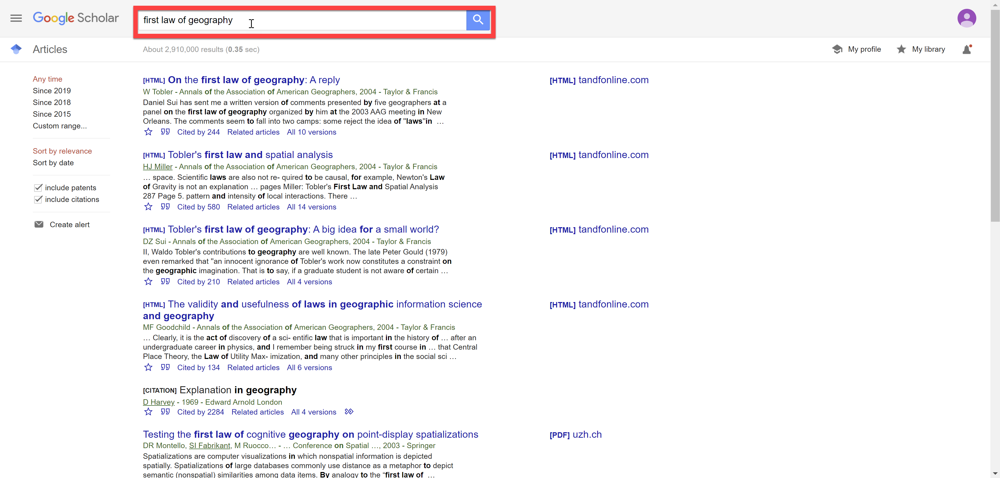

Once you have found the reference that you want, click on the quotation mark:

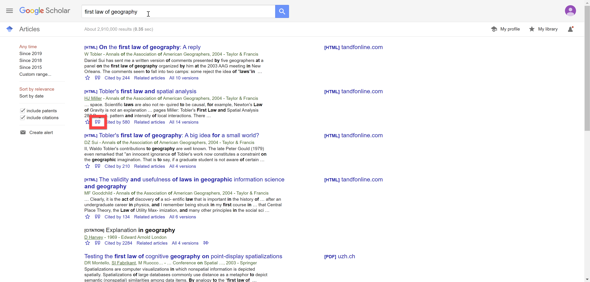

Then, in the window that pops up, select BibTeX. You can copy and paste the entry from there.

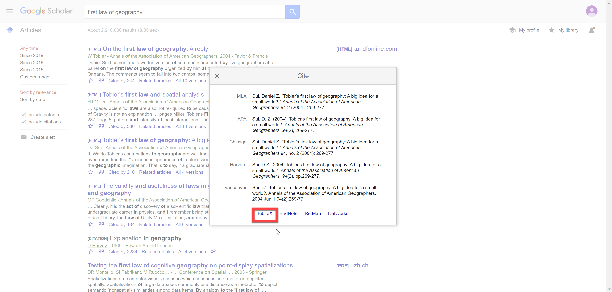

I often use Google Scholar, especially for references in the "gray" literature, that is, government reports, reports by international organizations, NGOs, etc., or for a more "shotgun" search. For more focused searches of the scientific and academic literature my preference is to use Web of Science (subscription needed, but most universities have access to this).

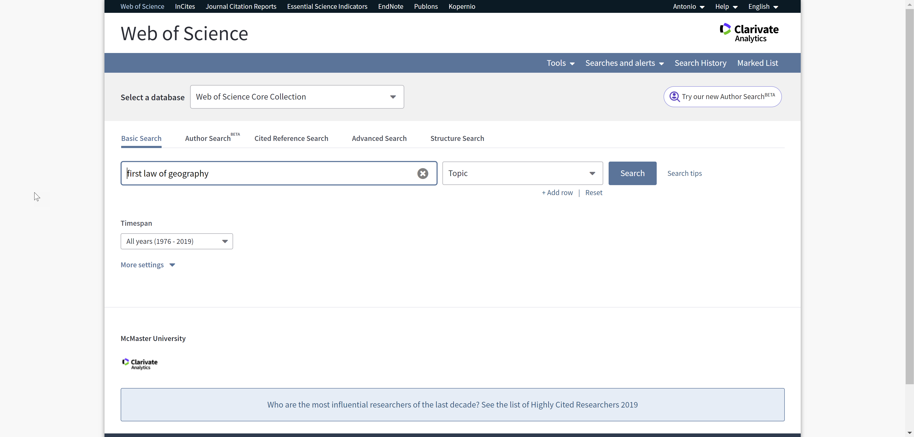

Once you have done a search, select the items that you wish to export and click the "Export" button:

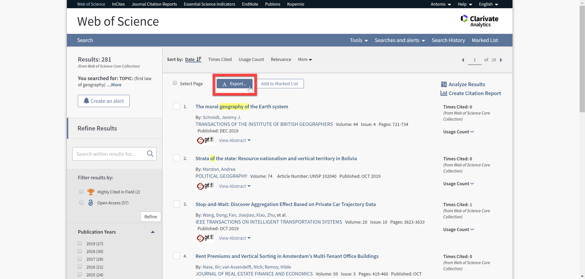

This will give you the option to save in other file formats:

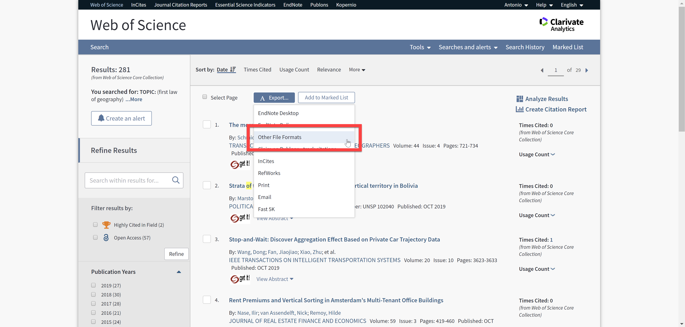

Other file formats include BibTeX:

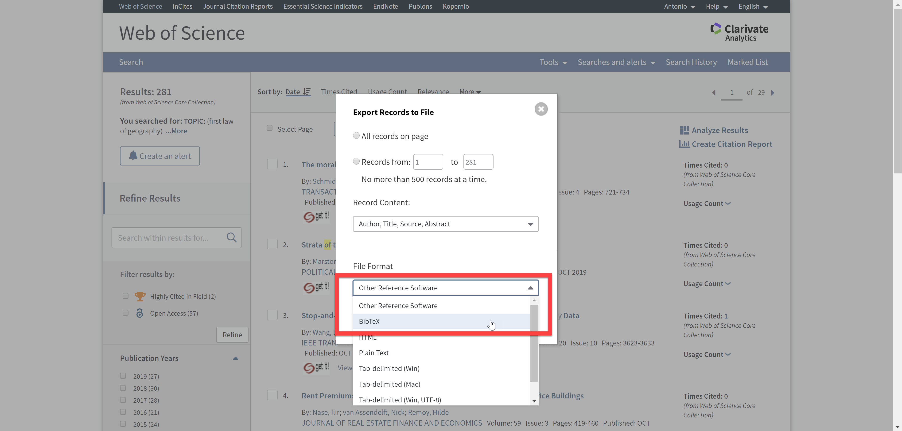

I currently keep a hybrid reference management system. I continue to use EndNote to keep my references, and then I export from EndNote to BibTeX as needed. If you already use EndNote, this might work for you. The only thing that you need to do is select BibTeX Export as the format, before copying all selected references with formatting. You can then paste these references to you `.bib` file:

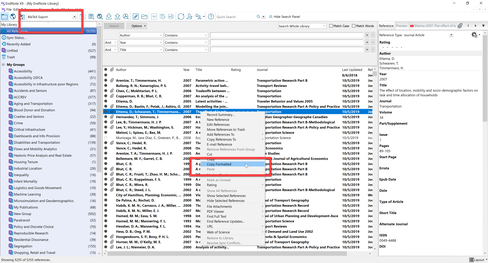

### Use Zotero

[Zotero](https://www.zotero.org/) is a free reference manager with amazing functionality and some good integration with R Studio. The [Zotero Connector](https://www.zotero.org/download/connectors) extension for Chrome, Edge and Firefox browsers makes it very easy to collect bibliographical information.

### In-text citations

The bibliography/list of references is generated automatically by the software, using the style defined in the `.csl` file. The bibliography will contain all references cited in the manuscript. There are different ways of citing references, as follows.

You can cite a reference in the text by using square brackets and the name of the entry preceded by the `@` symbol. For example, the text:

"According to recent research, urban green spaces serve multiple functions [see @van2010multifunctional; also @Reyes2014green]."

This would be rendered more or less in this fashion:

"According to recent research, urban green spaces serve multiple functions (see van Leeuwen et al., 2010; also Reyes et al., 2014)."

When referencing multiple entries at the same time, it is important to separate them by a semi-colon `;`. Don't forget the semi-colon!

It is also possible to use an in-text citation this way:

"According to @van2010multifunctional, urban green spaces serve multiple functions, a view that is echoed by other authors, including @Reyes2014green."

which would render as follows:

"According to van Leeuwen et al. (2010), urban green spaces serve multiple functions, a view that is echoed by other authors, including Reyes et al. (2014)."

As an alternative, a minus sign (i.e., `-`) before the `@` sign has the effect of suppressing the name(s) of the author(s) to render only the date:

"According to van Leeuwen et al. [-@van2010multifunctional], urban green spaces serve multiple functions, a view that is echoed by other authors, including Reyes et al. [-@Reyes2014green]."

### In-text citations using the visual rmarkdown editor

Starting with R Studio 1.4 there is a visual rmarkdown editor. This new editor provides some additional functionality, including the ability to insert references from your Zotero library or directly searching the web.

Tables are important elements in the presentation of research: they are used to summarize information in a form that is convenient and easy to understand. Creating tables using a word processor (\*cough\* Word \*cough\*) can be a pain due to strange behaviors when formatting cells, merging cells, etc. Furthermore, some tables need to be reproduced manually if the analyses change, something that is almost guaranteed to happen during the course of revisions, if not before.

### Tables:  markdown

Markdown has a simple way of creating tables, as we saw before in [Session 2](https://github.com/paezha/Reproducible-Research-Workflow/tree/master/Session-02-R-and-Markdown). This only requires the following format:

```
Header 1 | Header 2
- | -
Item 1 | Item 2
```

Which renders as:

Header 1 | Header 2
- | -
Item 1 | Item 2

The visual rmarkdown editor can also be used to create tables. This approach is not very useful when creating tables programmatically. So instead, there are several packages in `R` that are useful to create more sophisticated tables. 

### Tables: [{kableExtra}](https://haozhu233.github.io/kableExtra/)

My go-to package for this is {kableExtra}. The input for {kableExtra} is a data frame, which is convenient because likely most of the information you need to tabulate is there, or is the result of analysis thereof.

A table can be generated in a chunk of code using {kableExtra} as follows:

```
```{r descriptive-statistics, echo=FALSE}
descriptive.df <- data.frame(Statistic = c("Mean", "Min", "Max", "Standard Deviation"),
                             Population = c(mean(energy_and_emissions$Population),
                                            min(energy_and_emissions$Population),
                                            max(energy_and_emissions$Population),
                                            sd(energy_and_emissions$Population)),
                             GDPPC = c(mean(energy_and_emissions$GDPPC),
                                       min(energy_and_emissions$GDPPC),
                                       max(energy_and_emissions$GDPPC),
                                       sd(energy_and_emissions$GDPPC)),
                             bblpd = c(mean(energy_and_emissions$bblpd),
                                       min(energy_and_emissions$bblpd),
                                       max(energy_and_emissions$bblpd),
                                       sd(energy_and_emissions$bblpd)),
                             CO2_1995 = c(mean(energy_and_emissions$CO2_1995),
                                       min(energy_and_emissions$CO2_1995),
                                       max(energy_and_emissions$CO2_1995),
                                       sd(energy_and_emissions$CO2_1995)),
                             CO2_2005 = c(mean(energy_and_emissions$CO2_2005),
                                       min(energy_and_emissions$CO2_2005),
                                       max(energy_and_emissions$CO2_2005),
                                       sd(energy_and_emissions$CO2_2005)),
                             CO2_2015 = c(mean(energy_and_emissions$CO2_2015),
                                       min(energy_and_emissions$CO2_2015),
                                       max(energy_and_emissions$CO2_2015),
                                       sd(energy_and_emissions$CO2_2015)))

kable(descriptive.df)
```
```

This gives the following table in the output:

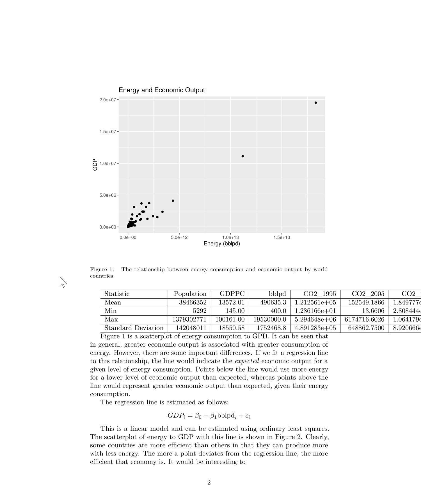

As you can see, this is not a great-looking table. It is too wide and difficult to read. I can improve this table in several different ways. First, it is possible to run `kable()` with `latex_options()`, one of which is to scale down the table so that it fits within the margins of the page:

```
kable(descriptive.df) %>%
  kable_styling(latex_options = c("scale_down"))
```

The result is a table that does not overflow, but now the font is too small for comfort. See:


A reason why the table is so wide in the first place is that the numbers reported are humongous. I can scale the values upstream to report smaller, easier to read numbers, and then pass that dataframe to `kable()`:

```
descriptive.df <- data.frame(Statistic = c("Mean", "Min", "Max", "Standard Deviation"),
                             Population = c(mean(energy_and_emissions$Population/1e6),
                                            min(energy_and_emissions$Population/1e6),
                                            max(energy_and_emissions$Population/1e6),
                                            sd(energy_and_emissions$Population/1e6)),
                             GDPPC = c(mean(energy_and_emissions$GDPPC),
                                       min(energy_and_emissions$GDPPC),
                                       max(energy_and_emissions$GDPPC),
                                       sd(energy_and_emissions$GDPPC)),
                             bblpd = c(mean(energy_and_emissions$bblpd/1e6),
                                       min(energy_and_emissions$bblpd/1e6),
                                       max(energy_and_emissions$bblpd/1e6),
                                       sd(energy_and_emissions$bblpd/1e6)),
                             CO2_1995 = c(mean(energy_and_emissions$CO2_1995/1e6),
                                       min(energy_and_emissions$CO2_1995/1e6),
                                       max(energy_and_emissions$CO2_1995/1e6),
                                       sd(energy_and_emissions$CO2_1995/1e6)),
                             CO2_2005 = c(mean(energy_and_emissions$CO2_2005/1e6),
                                       min(energy_and_emissions$CO2_2005/1e6),
                                       max(energy_and_emissions$CO2_2005/1e6),
                                       sd(energy_and_emissions$CO2_2005/1e6)),
                             CO2_2015 = c(mean(energy_and_emissions$CO2_2015/1e6),
                                       min(energy_and_emissions$CO2_2015/1e6),
                                       max(energy_and_emissions$CO2_2015/1e6),
                                       sd(energy_and_emissions$CO2_2015/1e6)))

kable(descriptive.df) %>%
  kable_styling(latex_options = c("scale_down"))
```

This improves to some extent the aspect of the table: it is not as wide and the numbers are easier to comprehend. See:

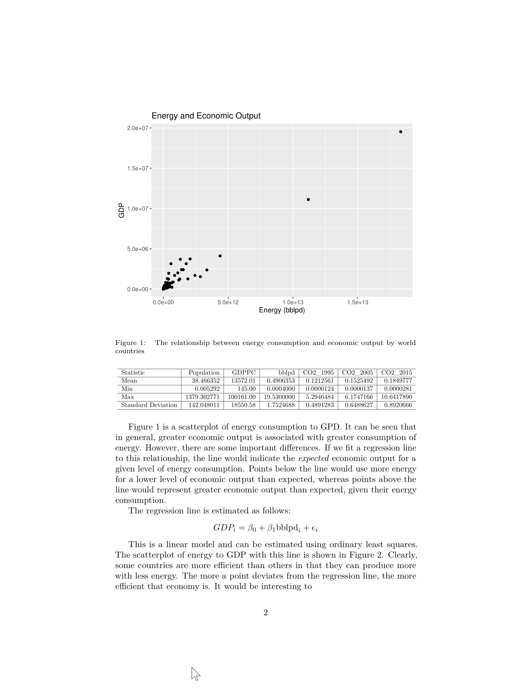

But I still have way too many decimals which are not particularly informative (typically only two to four [significant digits](https://en.wikipedia.org/wiki/Significant_figures) are needed). I can define the number of digits to use in the figure by using the argument `digits` in the call to `kable`:

```
kable(descriptive.df,
      digits = 3) %>%
  kable_styling(latex_options = c("scale_down"))
```

This gives a more compact table without all the trailing, less informative digits:

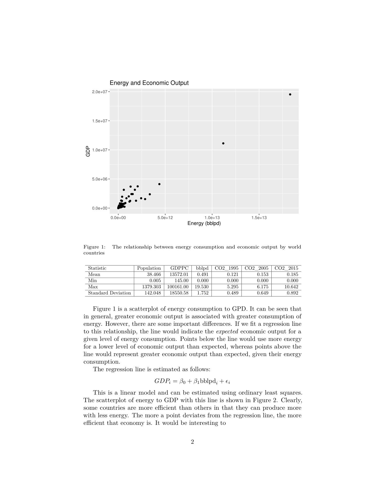

I can further make the table easier to read by adding stripes; also, I like the aspect of tables with booktabs, which removes unnecessary elements from the tables (like all those horizontal and vertical lines). The stripes are added as one of the `latex_options`, whereas booktabs are obtained by setting `booktabs = TRUE` in the call to `kable`:

```
kable(descriptive.df,
      digits = 3,
      booktabs = TRUE) %>%
  kable_styling(latex_options = c("striped", "scale_down"))
```

The table now is more pleasant to the eye, easier to read, and easier to understand too:

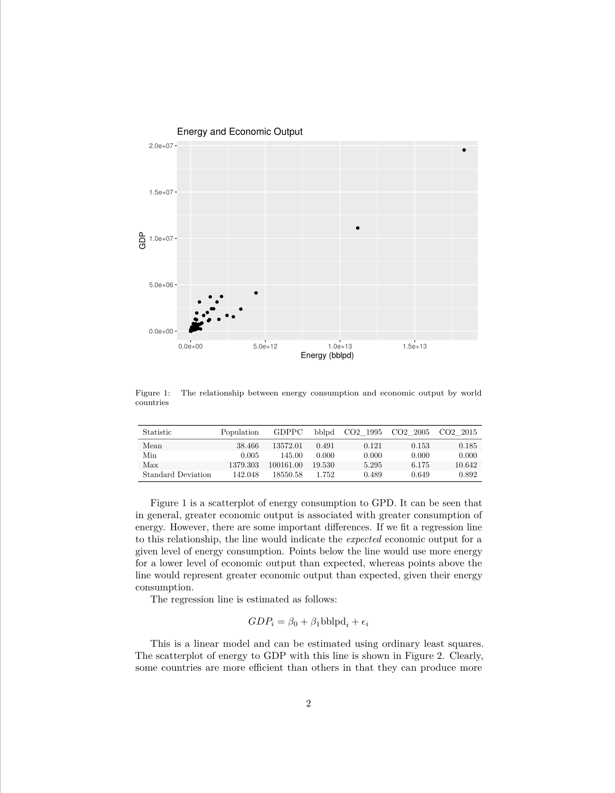

An issue after transforming the variables is that the units have changed! It is important to inform the reader of the units. I can change the names of the columns by creating a string for `col.names` as follows:

```
kable(descriptive.df,
      digits = 3,
      booktabs = TRUE,
      col.names = c("Statistic", 
                    "Population (in millions)", 
                    "GDP per capita", 
                    "Energy use (in millions of barrels per day)", 
                    "CO2 emissions (in millions, 1995)", 
                    "CO2 emissions (in millions, 1995)", 
                    "CO2 emissions (in millions, 1995)")) %>%
  kable_styling(latex_options = c("striped", "scale_down"))
```

Unfortunately, the long names of the columns again make the table too wide and the font too small:

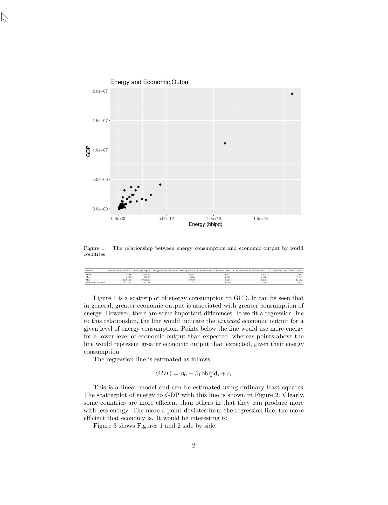

To introduce line breaks in the names of the columns, we need to use the function `linebreak()`. Line breaks are identified by `\n`. At this point, I also want to label the table for referencing purposes. The label is created by using a `caption` in the call to `kable`. The caption looks very similar to `fig.cap`, the captions of figures created within a chunk of code; see below:

```
kable(descriptive.df,
      digits = 3,
      booktabs = TRUE,
      escape = FALSE,
      col.names = linebreak(c("Statistic", 
                              "Population\n(millions)",
                              "GDP per capita\n(USD)",
                              "Energy use\n(millions of \nbarrels per day)", 
                              "CO2 1995\n(millions\nkilotonnes)", 
                              "CO2 2005\n(millions\nkilotonnes)", 
                              "CO2 2015\n(millions\nkilotonnes)"),
                            align = "c"), #Lower case "c" for center
      caption = "\\label{tab:descriptive-statistics} Descriptive statistics: energy and emissions of world countries") %>% 
  kable_styling(latex_options = c("striped", "scale_down"))
```

This leads to my final table:

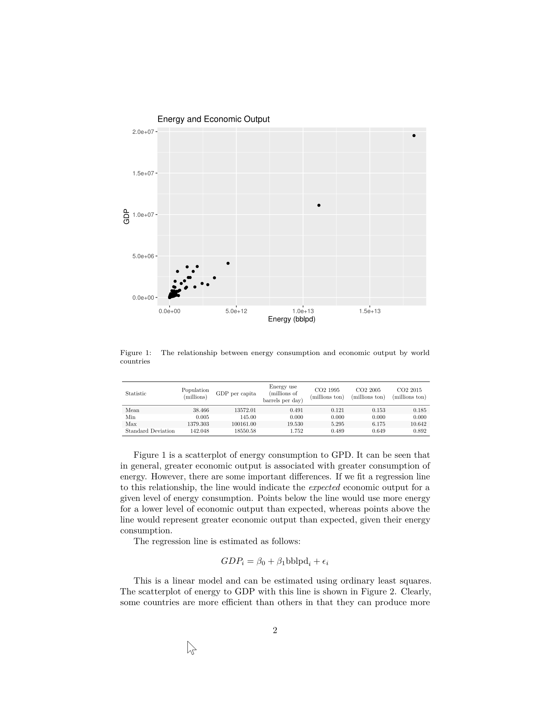

It is possible to create tables with the results of different kinds of analysis, and the only trick is knowing where to extract the different parts of the analysis that you wish to report (for example the coefficients, p-values, coefficients of determination, etc.)

The following code is an example of a table that reports the results of regressing $CO_2$ emissions on GDP by year:

```r
models.df <- data.frame(Estimate.1 = mod_1995$coefficients, 
                        pval.1 = paste(ifelse(summary(mod_1995)$coefficients[,4] > 0.0001, 
                                              round(summary(mod_1995)$coefficients[,4], 4), 
                                              "< 0.0001")),
                        Estimate.2 = mod_2005$coefficients, 
                        pval.2 = paste(ifelse(summary(mod_2005)$coefficients[,4] > 0.0001, 
                                              round(summary(mod_2005)$coefficients[,4], 4), 
                                              "< 0.0001")),
                        Estimate.3 = mod_2015$coefficients, 
                        pval.3 = paste(ifelse(summary(mod_2015)$coefficients[,4] > 0.0001, 
                                              round(summary(mod_2015)$coefficients[,4], 4), 
                                              "< 0.0001")))

kable(models.df,
      digits = 4,
      booktabs = TRUE,
      escape = FALSE,
      col.names = c("$\\beta$", "p-val", "$\\beta$", "p-val", "$\\beta$", "p-val"),
      caption = "\\label{tab:gdp-emissions-model-results} Regression results: Emissions by GDP by year") %>%
  add_header_above(c("Variable" = 1, 
                     "1995" = 2, 
                     "2005" = 2, 
                     "2015" = 2),
                   escape = FALSE) %>%
  footnote(c(paste("$R^2$ (1995) = ", as.character(round(summary(mod_1995)$r.squared, 2))),
             paste("$R^2$ (2005) = ", as.character(round(summary(mod_2005)$r.squared, 2))),
             paste("$R^2$ (2015) = ", as.character(round(summary(mod_2015)$r.squared, 2)))),
           escape = FALSE)
```

The table in the output document is this:

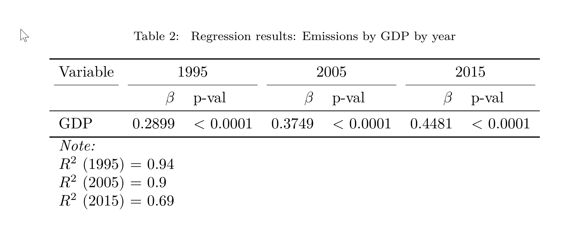

{kableExtra} can be used to do much more than this. This is an example of a table with sparklines:

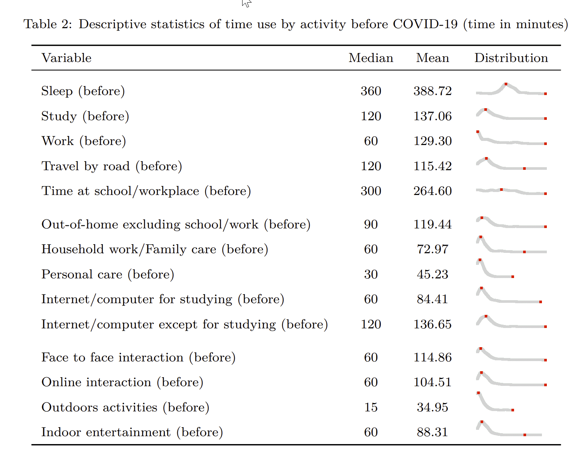

### Tables: [{GT}](https://gt.rstudio.com/)


With this, we have most of the elements to write a self-contained paper that reports reproducible research.

## Suggested readings

[BibTeX](http://www.bibtex.org/)  
[GT](https://gt.rstudio.com/)
[KableExtra for HTML](https://cran.r-project.org/web/packages/kableExtra/vignettes/awesome_table_in_html.html)  
[KableExtra for PDF](https://haozhu233.github.io/kableExtra/awesome_table_in_pdf.pdf)